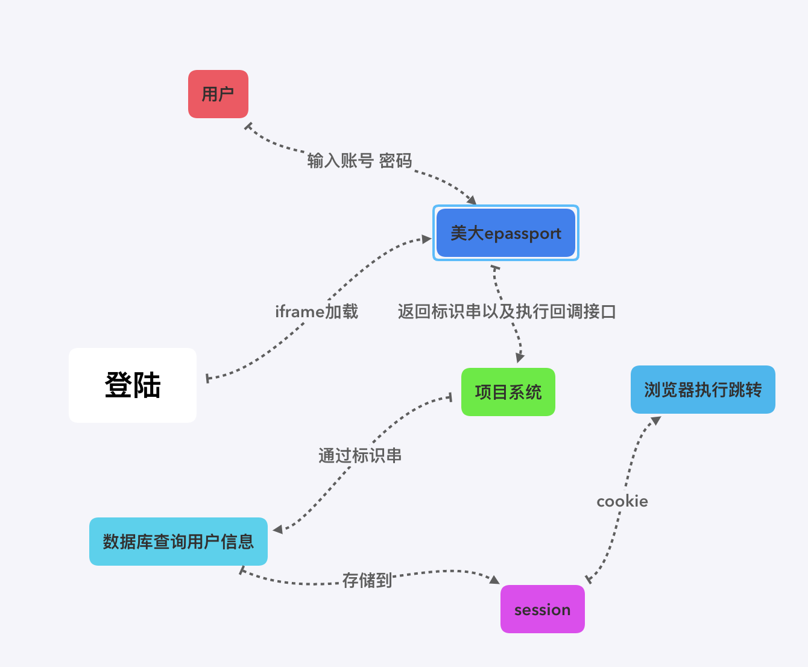

最近一周多的时间在做Koa相关的升级，由于项目Node服务侧三年多没有更新过，相关的依赖都非常老旧以及部分都不再维护了，已经影响了后续的开发，正好乘着业务需求的UI的视觉稿正在做，当前有一个空档期，因此这段时间把相关的依赖升级。没有想象中的那么困难，但是也有一部分没有自己想的那么简单。权当记录一下整个的过程以及遇到的问题和收获。

### 升级过程

#### 1. 调研

第一步都是要做好前期的调研，因为这个之前就讨论好已经准备升级了，所以说在上周都已经将具体要升级哪些依赖，升级到哪个版本，这些都记录在wiki中，具体要升级的部分以及部分的工作量有个体感了。

#### 2. 动工

这部分没什么好说的，因为现在的版本是koa1, 依赖co，使用的是yield generator。而要升级的koa2移除了co依赖，使用Promise，支持async await。因此依次将依赖升级到指定版本，将路由，控制器相关的语法修改。之后用postman测试个接口，发现没问题，这个时候好像一切都搞定了，升级也完成了。

### 问题

#### 1. 前端代码跑不起来

其实说的也不是很对，在本地使用webpack dev-server一切都是非常完美的，可是，当我将代码部署到staging机器的时候，白屏了！！！打开console面板一看

```js
Uncaught TypeError: Cannot read property 'call' of undefined
```

突然热血上头这个错误超出认知了啊，没法子开始排查问题吧，本地和staging最大的区别也就在webpack打包的mode不同了。于是rm -rf node_modules 并且重新安装依赖，然后在本地启动production打包，并且开启source-map，开启node进程。漫长的等待时候过后，打开页面，发现确实报错，并且具体内容尽然是ant design的icon包加载出了问题。突然有些蒙了，升级koa怎么会动到antd呢？于是去看了下代码的diff，发现在yarn.lock的文件里

```js
"@ant-design/icons@2.0.0":
  version "2.0.0"
  resolved "http://r.npm.sankuai.com/@ant-design/icons/download/@ant-design/icons-2.0.0.tgz#f9b8b16e188ec71ed40a24a0037f1a26d8c2be59"
  integrity sha1-+bixbhiOxx7UCiSgA38aJtjCvlk=
```

被修改为：

```js
"@ant-design/icons@~2.1.1":
  version "2.1.1"
  resolved "http://r.npm.sankuai.com/@ant-design/icons/download/@ant-design/icons-2.1.1.tgz#7b9c08dffd4f5d41db667d9dbe5e0107d0bd9a4a"
  integrity sha1-e5wI3/1PXUHbZn2dvl4BB9C9mko=
```

并且还有其他未被改动的包也被改动版本号了，为了修复问题也不想一点一点的修改，于是rm yarn.lock && rm -rf node_modules && yarn install。这个时候发现版本后都被改回来了。于是重新打包，发现可以啦。回到这个问题上，大概是在升级安装依赖的过程中，不知道怎么回事改动了版本号，造成webpack分块加载的过程中找不到chunks。

#### 2. 为啥我永远在登陆页

和第一个问题一样，在本地开发的过程中一切都没有问题，当部署到staging的时候，登陆之后继续跳转到登陆页。先说一下登陆的过程，我们这个项目是通过美大的epassport登陆的，通过iframe加载登陆框，当登陆之后美大会回传一个标识串，然后会执行一个回调把这个串传过来，这个回调是我们这边的接口，这个接口通过美大传递过来的标识串，向数据库查询用户的信息，之后存储到session中，然后返回一段html片段，该片段是一个script标签，执行前端的跳转，同时把sessionID放到cookie中带到浏览器这边。下图为流程图。

 

但是为什么我会一直待在登陆页呢？staging和本地主要的区别是staging利用的是上面的登陆逻辑，本地没有使用美大的epassport。难道是这部分出问题了。这个时候继续排查登陆的相关逻辑，发现确实没有问题，只是语法的修改，没有做什么逻辑的更改。这个时候我查看了下当前站点的cookie，发现本地和线上(未部署上线，还是原代码)都能写入cookie，而在staging的站点上登陆的cookie始终为空，这是为何？难道koa-session库有问题？

这个时候继续查找线下和staging的不同？二者主要的不同就在本地session未使用外部store，而staging使用的是tair(key-value的NoSQL数据库)，难道是这个的问题？于是在机器上打log，查看tair能否写入，同样发现写入不了，返回竟然是undefined。查看tair给的文档，发现只会有null。这个时候就有些发现是不是自己对tair的封装有问题，看了下koa-session的源码，执行外部store的get 和 set操作的时候都需要该方法是一个promise，而现在项目中并未将promise返回，于是修改代码。这个时候就发现修复了这个问题。

#### 3. 登陆好了，为什么接口报错413 request entity too large

当登陆问题修复好了时候，进入系统发现接口都是报错413，如果说只有一个接口报错还有可能是接口的问题，这明显就是我们这边的问题。查看了下接口请求，都没有被修改，当时一看请求头，cookie的内容一大堆，这个时候很明显错误找到了，再次进入koa-session的源码，发现如果没有传入外部store，它会将session的所有内容加密写入cookie中，由于用户的信息量比较大，因此会造成cookie过长。于是针对本地开发，实现一个外部store，将session放到一块内存中，也就是一个对象里。这个时候就发现这个问题也解决了。

#### 4. post的转发接口都报错

这个时候基本都没啥大的问题了，于是依次进入系统的页面，发现大部分的都能正常工作，但是还是有三个接口报错。并且这三个接口还都是第三方的接口，并且还都是post请求。于是找了其中一个接口的java后端RD，两人联调了一下，发现对方根本接收不到数据，而我这一直返回500。而单独请求该接口，一切正常。所以说这个锅还是要自己背，继续排查问题啊，然后看代码diff，和之前没问题的状态的唯一区别就是我把接口的获取post的请求体放到了项目的最开始，而之前是放在router的中间件中。于是把koaBody中间件的调用放到了proxy中间件之后，路由之前的时候，接口就一切正常了。

这又是怎么回事呢？原来是由于请求是一个Stream，在koaBody中间件中已经消费了这个流。可是我们的proxy中间件使用的是 [http-proxy-stream](https://github.com/wenshin/http-proxy-stream),而它接收的request就是一个流，也就是说如果一个流被消费后再转发，其数据就为空了。这也是为什么接口报错，因为对方接收的数据都是null。

### 收获

在整个过程中，遇到问题都还好，因为是有心理准备的。其中比较糟心的是在发现问题原因的这个过程中，只要问题的原因找到了，要么绕过，要么修复，问题都不大。而当在排查问题的过程中，必须要不断的缩小问题的范围，一点点的去找到问题。所以说考验一个人的往往是找到问题原因的能力。

同样在这个过程中也提高了自己对整个系统的理解，整个项目的流程更加熟悉了。不足之处就是，一方面是运维的能力，shell的掌握，虽然之前看过鸟哥的Linux私房菜基础篇，后续还需要对这方面加强。另一个方面就是对后端的掌握上，深入原理的掌握，这个就需要深炼内功。加强基础知识的学习。