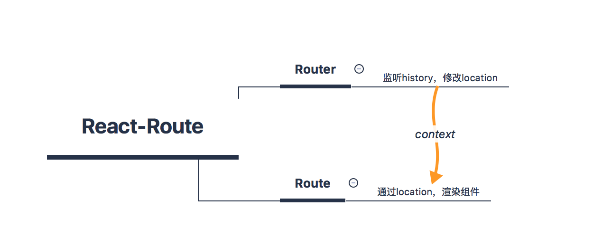

### 概论
路由在前端中我们可以理解为是将URL和视图的一种映射关系，URL的更新引起页面的更新。在web2.0之前，没有ajax，页面每次都需要全量刷新。有了ajax，有了浏览器提供的api，我们从而有了SPA(单页应用)。

react-router4开始将其分为react-router, react-router-dom, react-router-native。react-router是核心的代码，react-router-dom, react-router-native分别是针对浏览器环境和移动端IOS，android作的适配。本次的源码阅读的版本是v5.0.1，主要是react-router。



React-Router的各个模块都是一个React组件，主要看Router、Route、Switch、Link、Redirect。

### Router组件
那么首先先来看Router，它现在constructor中监听props.history的变化, 从而修改state中的location值

```js
this.unlisten = props.history.listen(location => {
  if (this._isMounted) {
    this.setState({ location });
  } else {
    this._pendingLocation = location;
  }
});
```

_isMounted是当组件未挂载时，赋值给_pendingLocation，会在componentDidMount更新为location的值。否则就直接更新location值。

那么Router组件是如何和其他组件通信的呢？整体来看，Router是路由的顶级组件，它通过context将路由的信息传递给它的子组件。

```JS
render() {
  return (
    <RouterContext.Provider
      children={this.props.children || null}
      value={{
        history: this.props.history,
        location: this.state.location,
        match: Router.computeRootMatch(this.state.location.pathname),
        staticContext: this.props.staticContext
      }}
    />
  );
}
```

RouterContext是react-router中的context对象，这是react16中的新的一种实现context语法。通过<Provider>设置context的值，从这里也能看出来RouterContext的值有history，location，match和staticContext。

### Route组件
接下来看下Route组件，可以看出Route组件被<RouterContext.Consumer>包裹，所以说当<RouterContext.Provider>也就是Router组件的值更新的时候，Route组件就会更新。对于Route组件来说最重要的就是他在定义的时候的路由信息是否匹配当前的路由。

```js
const location = this.props.location || context.location;
const match = this.props.computedMatch
  ? this.props.computedMatch // <Switch> already computed the match for us
  : this.props.path
  ? matchPath(location.pathname, this.props)
  : context.match;
```
computedMatch是Switch组件向子组件传递的一个属性，主要看path的那部分，如果Route组件有自己的path值，那么就会返回matchPath(location.pathname, this.props)的结果，否则返回context.match，也就是说当Route组件没有path值的时候，它会在其他组件被匹配的时候也是匹配的状态，也就是这个时候这个Route的组件就是一个公共组件，都会展示出来。

```js
function matchPath(pathname, options = {}) {
  const { path, exact = false, strict = false, sensitive = false } = options;

  const paths = [].concat(path);

  return paths.reduce((matched, path) => {
    if (!path && path !== "") return null;
    // matched不是null，说明已经有Route被匹配了
    if (matched) return matched;

    const { regexp, keys } = compilePath(path, {
      end: exact,
      strict,
      sensitive
    });
    const match = regexp.exec(pathname);

    // 当前的pathname不匹配path
    if (!match) return null;

    const [url, ...values] = match;
    const isExact = pathname === url;

    // 如果是精确匹配而没有匹配则返回null
    if (exact && !isExact) return null;

    return {
      path, // the path used to match
      url: path === "/" && url === "" ? "/" : url, // the matched portion of the URL
      isExact, // whether or not we matched exactly
      params: keys.reduce((memo, key, index) => {
        memo[key.name] = values[index];
        return memo;
      }, {})
    };
  }, null);
}
```
可以看出matchPath的实现还是非常巧妙的，通过reduce实现了路由的匹配。那么路由匹配之后是如何渲染的呢？

```js
props.match
  ? children
    ? typeof children === "function"
      ? children(props)
      : children
    : component
    ? React.createElement(component, props)
    : render
    ? render(props)
    : null
  : typeof children === "function"
  ? children(props)
  : null
```

先判断是否有children，children可以是函数也可以是React元素，否则如果component存在则渲染component，否则render存在，调用render方法，如果children、component和render都不存在，则返回null，不渲染。

### Switch组件
刚才看到了Route是否匹配最先看的是computedMatch，我们看下Switch组件是如何匹配路由的。
Switch组件也是被<RouterContext.Consumer>包裹，之后会遍历它的子组件，克隆第一个被匹配的Route组件。

```js
React.Children.forEach(this.props.children, child => {
  // 还没有匹配到
  if (match == null && React.isValidElement(child)) {
    element = child;

    const path = child.props.path || child.props.from;

    match = path
      ? matchPath(location.pathname, { ...child.props, path })
      : context.match;
  }
});

return match
  ? React.cloneElement(element, { location, computedMatch: match })
  : null;
```

如果匹配了，会看到它将匹配结果match的值作为computedMatch传给子组件，这样子的话Switch的Route就不会再重新匹配路由。这里也能看出，Switch组件内的子组件只会被匹配一个。

### Link组件
Link组件是一个函数式组件，先通过forwardRef将外部的ref转发给组件内部元素component上去，component默认为其自身定义的LinkAnchor。那么对于Link组件如何处理路由的呢？

```js
const location = normalizeToLocation(
  resolveToLocation(to, context.location),
  context.location
);
```

如果to是string，resolveToLocation直接返回to,否则返回to(context.location), normalizeToLocation生成Link组件代表的路径。真实的点击还是到了LinkAnchor上

```js
let props = {
  ...rest,
  onClick: event => {
    try {
      if (onClick) onClick(event);
    } catch (ex) {
      event.preventDefault();
      throw ex;
    }

    if (
      !event.defaultPrevented && // onClick prevented default
      event.button === 0 && // ignore everything but left clicks
      (!target || target === "_self") && // let browser handle "target=_blank" etc.
      !isModifiedEvent(event) // ignore clicks with modifier keys
    ) {
      event.preventDefault();
      navigate();
    }
  }
};
props.ref = innerRef;
return <a {...props} />;
```

可以看到Link标签的本质还是a标签，不过通过将onClick事件方法拦截，最终调用navigate，而navigate是通过调用history.replace或者history.push方法。

### Redirect组件
Redirect组件是对Lifecycle的封装，Lifecycle会在组件挂载的时候调用onMount，更新的时候调用onUpdate，卸载的时候调用onUnmount。

```js
const location = createLocation(
  computedMatch
    ? typeof to === "string"
      ? generatePath(to, computedMatch.params)
      : {
          ...to,
          pathname: generatePath(to.pathname, computedMatch.params)
        }
    : to
);
```

location的值需要依赖history的方法，createLocation通过名字我们知道它是生成URL的，所以具体如何实现的，可以先不用管，可以在之后读读history的源码

```js
<Lifecycle
  onMount={() => {
    method(location);
  }}
  onUpdate={(self, prevProps) => {
    const prevLocation = createLocation(prevProps.to);
    if (
      !locationsAreEqual(prevLocation, {
        ...location,
        key: prevLocation.key
      })
    ) {
      method(location);
    }
  }}
  to={to}
/>
```
可以看出来Redirect组件会在组件挂载和更新的时候时候更改URL，从而更新UI视图。

从以上可以看出react-router是在React基础上的对路由的封装，当然在浏览器环境，它还是需要依赖history这个库，这个就需要之后来阅读它的代码。

