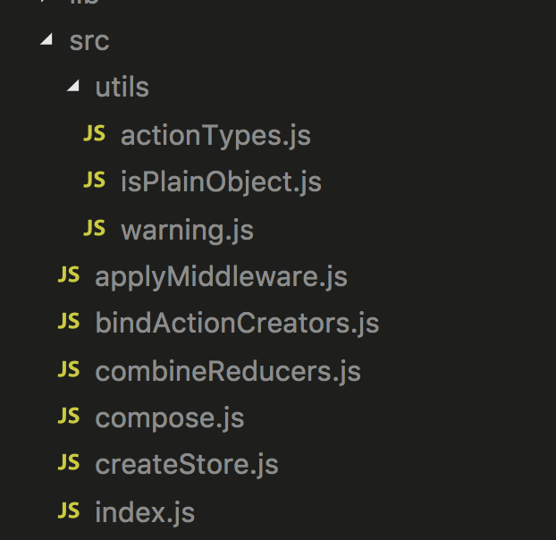

### redux概述
redux提供了一种数据状态管理的机制。它通过维护唯一的一个数据源state，作为全局的数据。当更新数据时dispatch（触发）一个action（动作），此时我们会执行reducer函数来修改，从而生成一个新的数据源（因为数据源state不可修改，只能返回新的state）。通过这种单向的数据流，使得整个应用变的可预测以及可维护。为什么说这种单向的数据流会被大家接受？因为如果没有这种强制性的数据单向流动，在复杂的应用中，当接手项目时，理清项目的思路是一件比较麻烦的事情。当然，如果项目复杂度没有到一定程度的话，使用redux同样是得不偿失。

### 源码解读
 
 1. 整个项目目录为 
   
  utils文件下为工具函数，
    1. actionTypes.js 作为redux的默认actionType，在我们项目中设定的actionType一定不能和默认的一样。
    2. isPlainObject.js 其检查传入参数是否为纯粹的对象，何谓纯粹的对象，也就是{} new Object 以及没有原型的对象（原型为null），这个对象含有0个或多个键值对。
    3. warning.js 作为错误日志方法。如果没有console.error 则throw new Error（），否则执行console.error.
 
 2. 工具函数介绍完，首先介绍入口文件，也即是index.js.
 
   ```js
   export {
	    createStore,
	    combineReducers,
	    bindActionCreators,
	    applyMiddleware,
	    compose,
	    __DO_NOT_USE__ActionTypes
	 }
   ```
   由此可见共包含5个模块，接下来依次介绍。
   1. createStore模块
   
    其最多可以接受三个参数，分别是reducer, preloadedState, enhancer.其中reducer为必传项，且必须为function类型，返回对象为当前state。preloadedState非必传项，若不传则默认为undefined。而enhancer也是非必传项，但是如果传值，则只能传递一个enhancer，且必须为function类型。
    
    在createStore模块内部中维护了5个变量
    
    ```js
   let currentReducer = reducer // reducer函数
	  let currentState = preloadedState // 当前的state
	  let currentListeners = [] // 当前观察者列表
	  let nextListeners = currentListeners  // 下一次观察者列表
	  let isDispatching = false  // 是否触发action
    ```
     模块初始调用dispatch方法，传入的action对象type为actionTypes.js中的INIT，所以说这也是为什么在使用redux时，不能使用actionTypes.js中的INIT。dispatch方法的简介版便是
     
     ```js
     function dispatch(action) {
       try {
	        isDispatching = true
	        currentState = currentReducer(currentState, action)
	      } finally {
	        isDispatching = false
	      }

	      const listeners = (currentListeners = nextListeners)
	      for (let i = 0; i < listeners.length; i++) {
	        const listener = listeners[i]
	        listener()
	      }

	      return action
     }
     ```
     传入state和action对象执行reducer函数,并返回新的state，之后将nextListeners中的listener逐一执行调用。
     
     subscribe方法作为添加观察者的方法，其作为一个高阶函数，传入参数为listener，并将其添加到nextListeners列表中，返回一个unsubscribe方法，可以取消订阅。精简代码为
     
     ```js
     function subscribe(listener) {
       let isSubscribed = true;
       nextListeners.push(listener); // 压栈
       
       return function unsubscribe() {
         if (!isSubscribed) {
           return
         }

         isSubscribed = false

         const index = nextListeners.indexOf(listener) //删除
         nextListeners.splice(index, 1)
       }
     }
     ```
     通过以上能够发现，在这个模块中使用了观察者模式，内部维护一个列表，通过subscribe添加观察者，dispatch执行调用。
     
     剩下的getState方法就是返回currentState