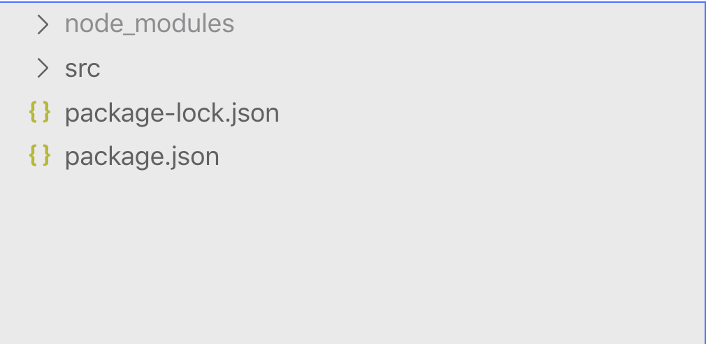
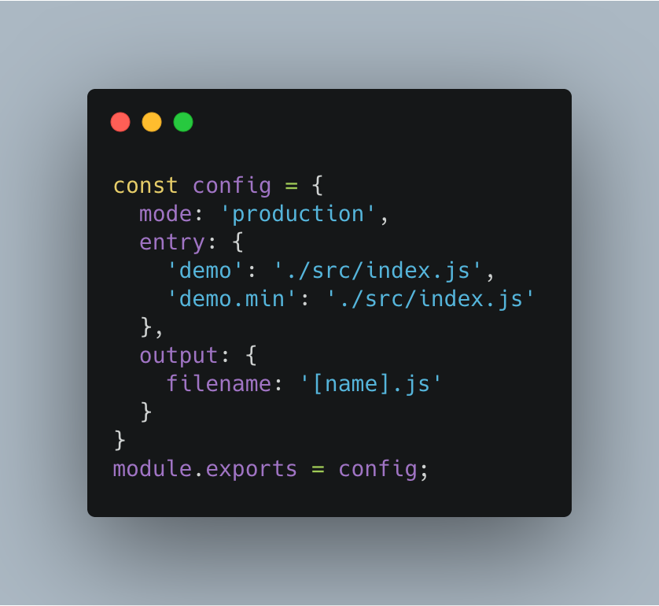
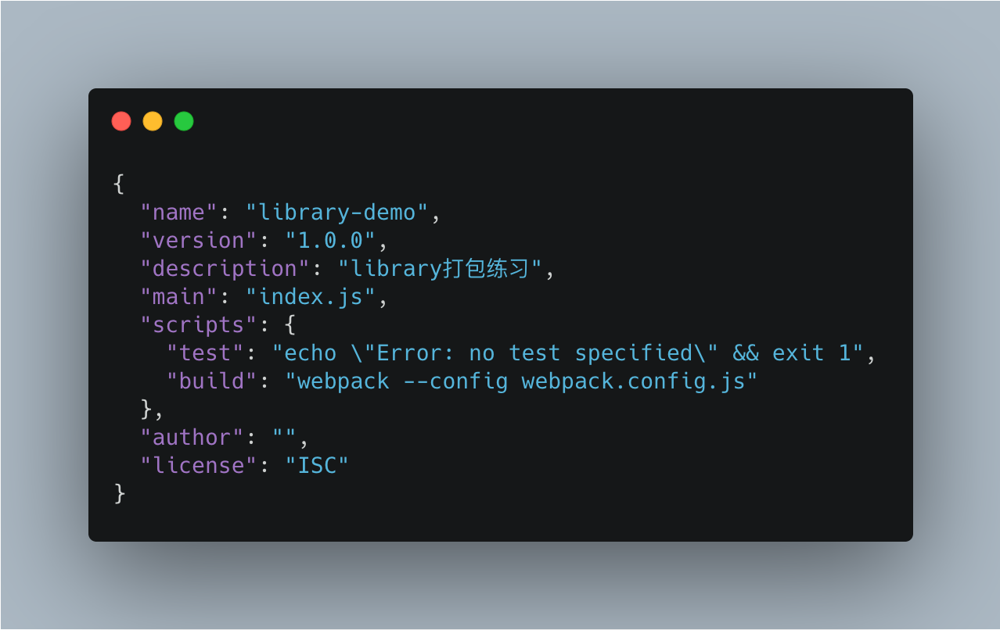
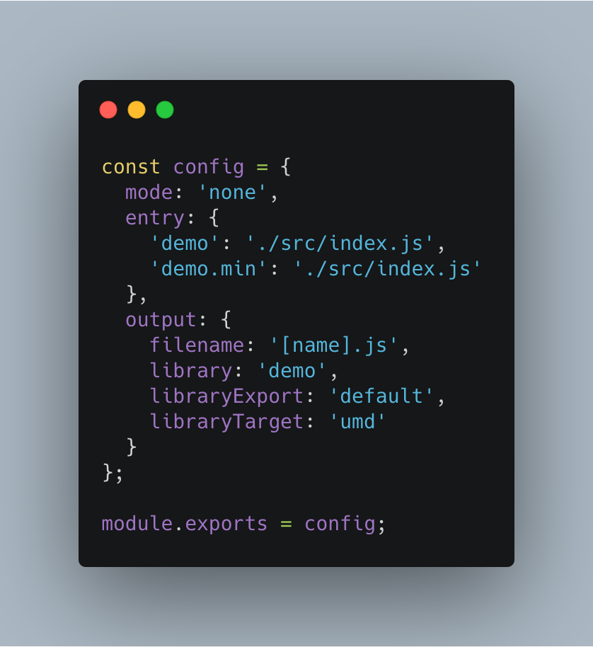
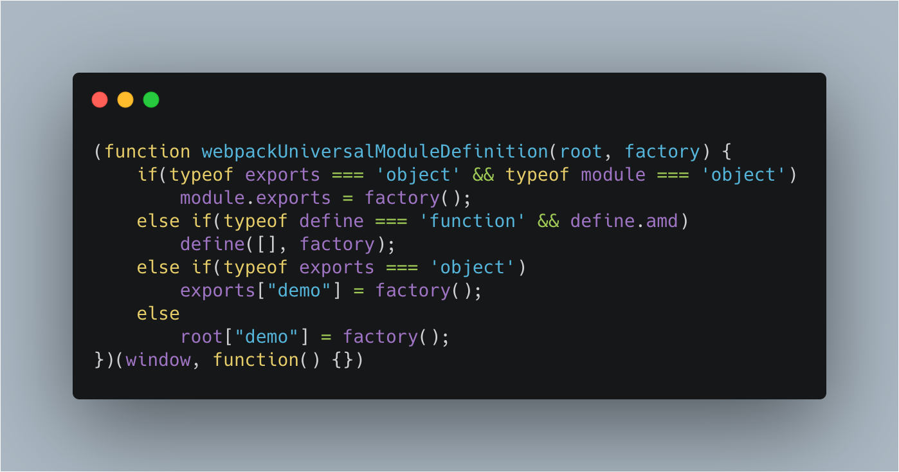
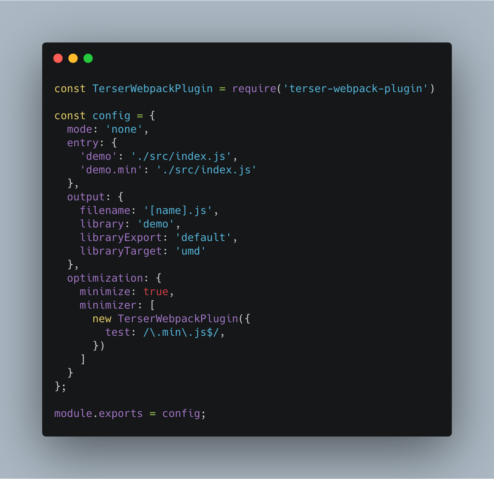
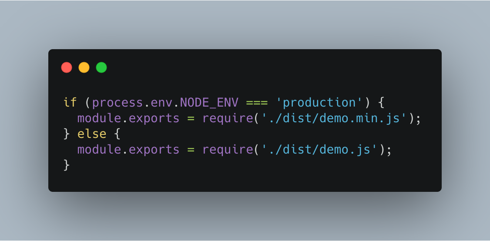

现在前端开发我们需要依赖NPM包，那么如何把我们自己封装好的组件上传到npm上呢？那这个时候就需要打包编译工具了，一般来说，打包编译库都是使用rollup，但是由于我们在实际开发项目的过程中都是使用webpack, 同样的工具有一个熟悉，当需要另一种的时候看看文档就行了。因此我们使用webpack来打包一个组件库。

当然先初始化npm 
```sh
mkdir library-demo && cd library-demo
npm init -y
```

然后在生成一个src目录，我们的源代码都放到该目录下。整个项目结构为：


这个时候我们先实现一下我们的库，在src目录下的新建index.js文件。代码如下
```
function add(a, b) {
  return a + b;
}

export default add;
```

首先先来看一下，作为一个公共的库，应当有两个版本，一个是生产版本，一个是线上版本。生产版本就是代码非压缩，线上版本应当是代码压缩过的。我们把两个不同的版本的文件名定义不同，分别为
```js
demo.js // 线上版本
demo.min.js // 生产版本
```
接下来就需要实现一下webpack的编译，新建webpack.config.js文件，内容如下


在package.json中添加命令build


这个时候我们执行
```sh
npm run build
```

我们发现打包后的代码是压缩过的，并且只是一段执行的JavaScript代码，并没办法模块化的引用，这个时候还是需要继续修改webpack.config.js文件内容



首先先把mode修改为none, 因为webpack4之后production模式已经内置了js的代码压缩。在output中library是指我们这个库的名称为demo, libraryExport是指直接返回demo.default对象，libraryTarget表示我们打包的内容支持AMD和commonJS。


这个就是打包后的内容就，但是发现min.js文件并未被压缩，这个时候还需要一个webpack插件TerserWebpackPlugin。

```
npm install terser-webpack-plugin -D
```
修改一下webpack.config.js文件, 这就是打包一个库所需要的内容了。



但是还有一点，那就是在package.json中的入口文件是index.js,我们需要在这个文件中区分生产环境还是线上环境

因此在整个项目的根目录，新建index.js文件，内容为：


接下来只需要登陆npm账号，执行
```
npm run build
npm publish
```

即可将我们的包发布到npm社区中。


