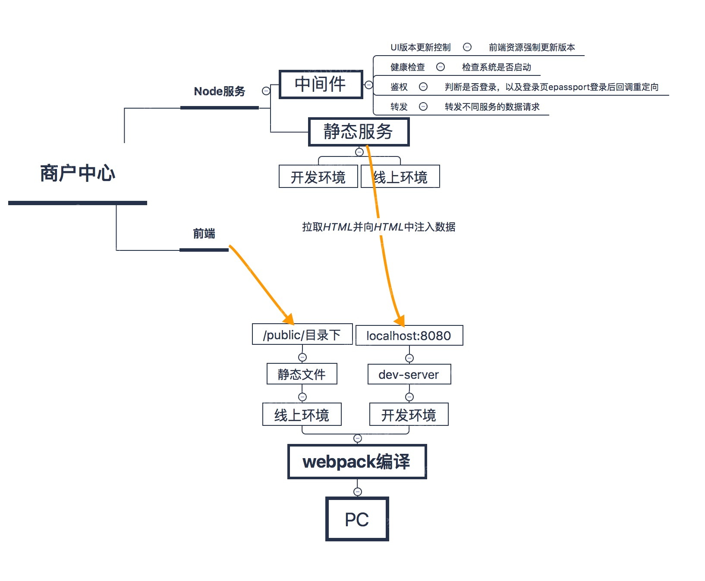
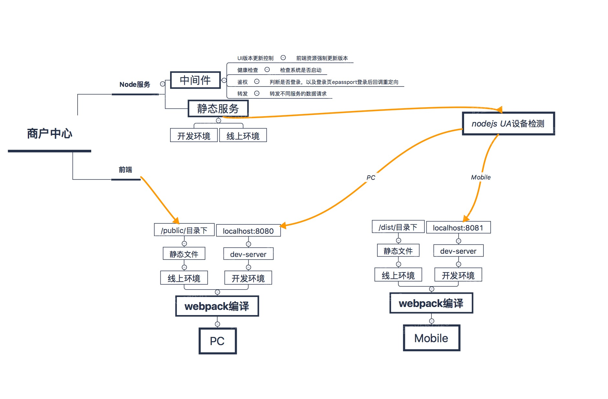
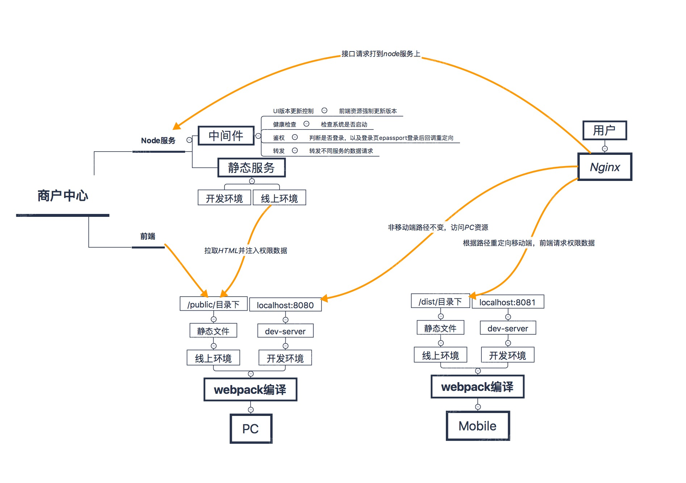

背景：前几篇文章都是为了商家中心系统的移动端所做的工作，当项目搭建完成后，本地能跑起来了。之后才发现如何部署，如何和当前的系统适配，这个问题还没有考虑清楚。

首先先说明一下当前商户系统的架构，用户访问浏览器，浏览器将流量打到Nginx上，Nginx主要的功能是负载均衡，也就是将流量分别打到四台NodeJS机器上。NodeJS作为中间层，相对来说还是比较薄的一层，其功能一方面作为前端静态资源服务器，另一方面是包好了转发代理、登录校验即鉴权、以及健康检查、UI版本控制和前端安全防御如CSRF。如下图

这个整体是一个系统，现在想要接入web移动端，这个接入的是前端的代码，所以说NodeJS服务器的逻辑代码应当是共用的，

因此第一个想法是NodeJS层做设备检测，这样如果发现流量是移动设备则将移动端的单页HTML文件响应回去，否则还是原来的PC端的HTML文件。

这样有一个什么问题呢？第一就是NodeJS做设备检测，以当前的架构来说需要将移动端的代码分别部署到当前的每台机器上，需要重写整个部署脚本以及修改UI版本控制那部分代码。第二、现在的web移动端刚开始做，不知道要做到哪种程度，由于还缺失移动端的页面，除非在设备检测的时候做特殊处理，否则移动设备访问未开发移动版本的页面都会是404。整体流程图如下：

第二种方案是：移动端和PC分开是两套系统，设置为不同的URL，在Nginx上面做转发，这样原来的一套流程不需要任何的改动，我们只需要改动Nginx的配置就行。整体流程图如下：

技术不是炫技，还是需要考虑开发人力成本，业务风险等各种情况。由于我们这次的web移动端主要是嵌套在小程序和APP中，因此具体效果也是一种尝试，如果这次修改太大的话，后续一旦不适用当前这种小程序和APP共用一套代码的方案的时候，又需要全部恢复回来，改动越大，出问题的几率越大。因此选择了第二种方法。

当然，通过对当前系统架构的整理，一方面对系统的了解更深了一些，也发现了之后系统的改进，最明显的就是可以将前端资源CDN化，而不是像当前用NodeJS当做静态资源服务器
