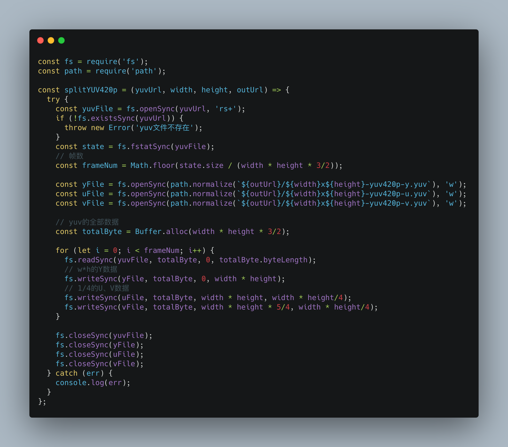
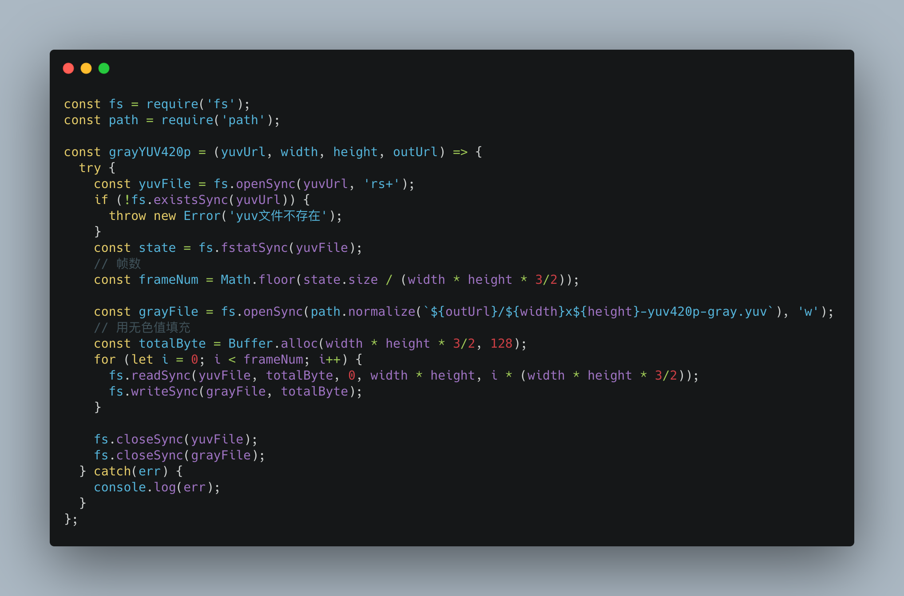
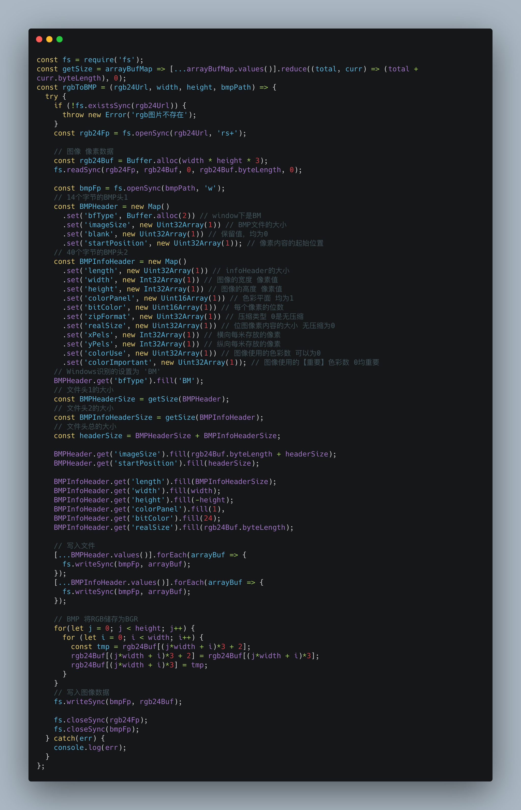
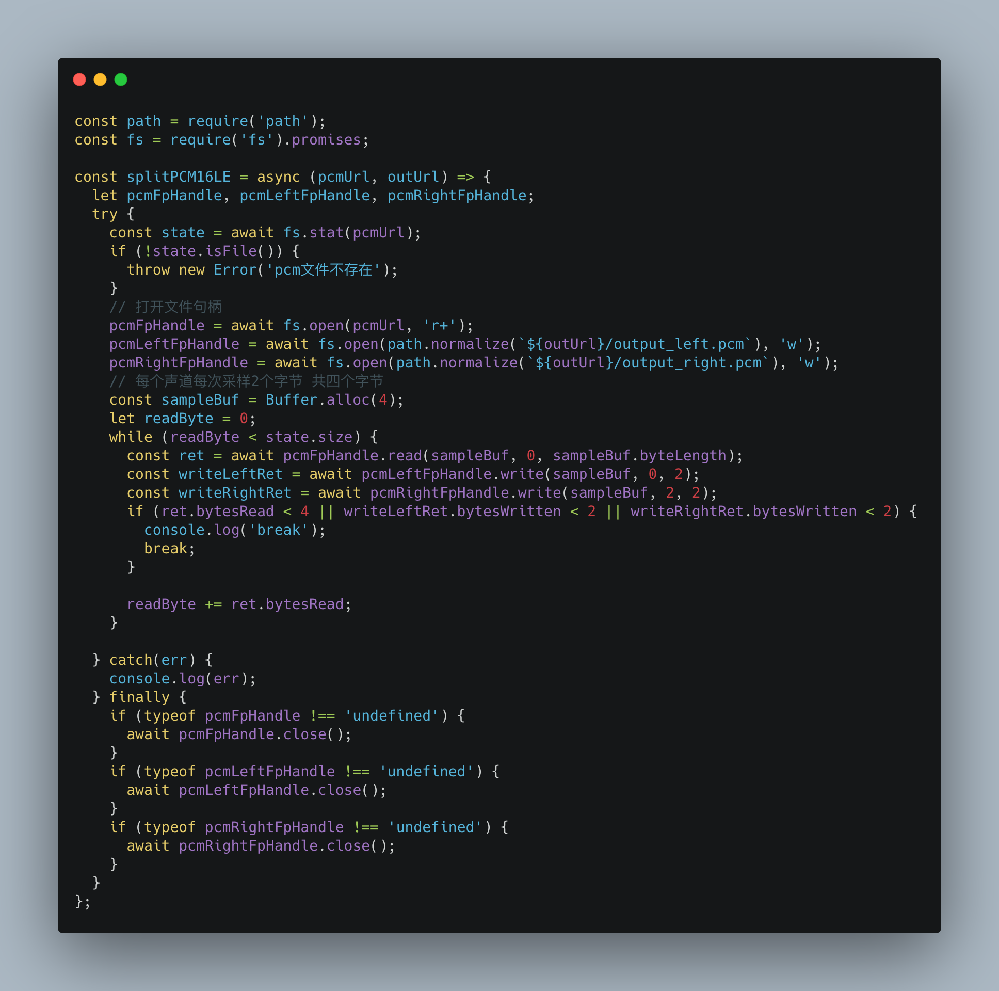
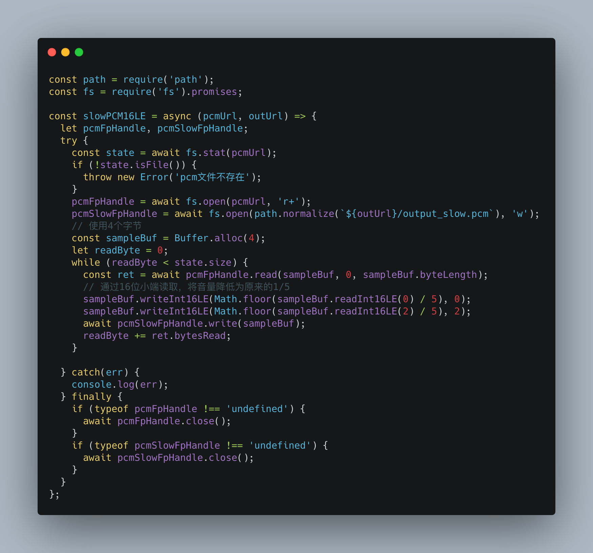

通过上一篇[前端入门音视频-基础篇
](https://tech.bytedance.net/articles/6882277853832937485)我们知道了音视频的底层数据是PCM和YUV，那对这些数据如何处理呢？通过用NodeJs实现，加深对PCM和YUV数据的理解。为了能够验证我们的实现是否有问题，使用ffmpeg作为工具。

ffmpeg的安装可以看这篇文章 [macOS上编译FFmpeg](https://daking.tech/ffmpeg/macOS上编译FFmpeg.html#macos上编译ffmpeg-2). 以下是将要使用到的ffmpeg的命令

```
// 生成音频
ffmpeg -i douyin.mp4 -vn -ar 44100 -ac 2 -f s16le audio_44100_2_16le.pcm

// 播放音频
ffplay audio_44100_2_16le.pcm -ar 44100 -ac 2 -f s16le
```

```
// 只保留视频 生成yuv
ffmpeg -i douyin.mp4 -an -c:v rawvideo -pixel_format yuv420p  544x960_yuv420p.yuv

// 播放YUV
ffplay -video_size 544x960 -pixel_format yuv420p 544x960_yuv420p.yuv

// 单独提取一个分量
ffmpeg -i douyin.mp4 -pixel_format yuv420p -video_size 544x960 -vf extractplanes='y' 544x960_yuv420p_y.yuv

// 单独播放Y分量
 ffplay -video_size 544x960 -pixel_format gray 544x960_yuv420p_y.yuv
```

### 分离YUV420p数据

我们处理的是YUV420的一种平面存储格式，在内存中以Byte的形式，依次存储Y、U、V。通过具体的代码也发现，U、V的数据量是Y分量的1/4。




播放单一分量就可以通过

```
ffplay -video_size 544x960 -pixel_format gray 544x960_yuv420p_y.yuv
```
不过在播放U、V分量的时候video_size的宽、高均要除以2。即
```
ffplay -video_size 272x480 -pixel_format gray 544x960_yuv420p_u.yuv
```

### YUV变成灰度图



色值度的范围是0-255，中间值128即是无色，把色度值都调整为128，只保留亮度，也就是Y分量的值

### 将RGB24转成BMP

BMP是在windows下常用的一种位图，可以直接在RGB24上添加文件头信息，即可转成BMP文件。主要用到了ArrayBuffer，这是因为ArrayBuffer直接使用本机使用的字节序，不需要在代码里面检测大小端问题。



### 分离双声道PCM16LE数据

PCM16表示每个声道的采样大小是两个字节，间隔储存。这个是使用了返回promise的fs API。



### 降低PCM16LE双声道音量

LE表示数据是按照小端字节序储存的，因此在降低音量的时候，需要按照16LE读取，计算的值再以16LE写入。C/C++可以使用short类型来表示，而在Javascript中并没有，所以需要这么处理。



### 总结

以上便是通过学习参考文档中雷神的文章，用NodeJs实现其中部分功能。个人体会，JavaScript的性能还是没有C快，不过两种风格的语言对二进制的处理，细品一下回味无穷😂


参考文档

[雷霄骅视-音频数据处理入门：RGB、YUV像素数据处理](https://blog.csdn.net/leixiaohua1020/article/details/50534150)

[雷霄骅视-视音频数据处理入门：PCM音频采样数据处理](https://blog.csdn.net/leixiaohua1020/article/details/50534316)

[使用 C++ 读取简单的 24、32 位 BMP 图像](https://blog.taoky.moe/2017-02-06/read-bmp-with-cpp.html)

[浅析ArrayBuffer、TypedArray和Buffer](https://juejin.im/post/6844903889364336654)

