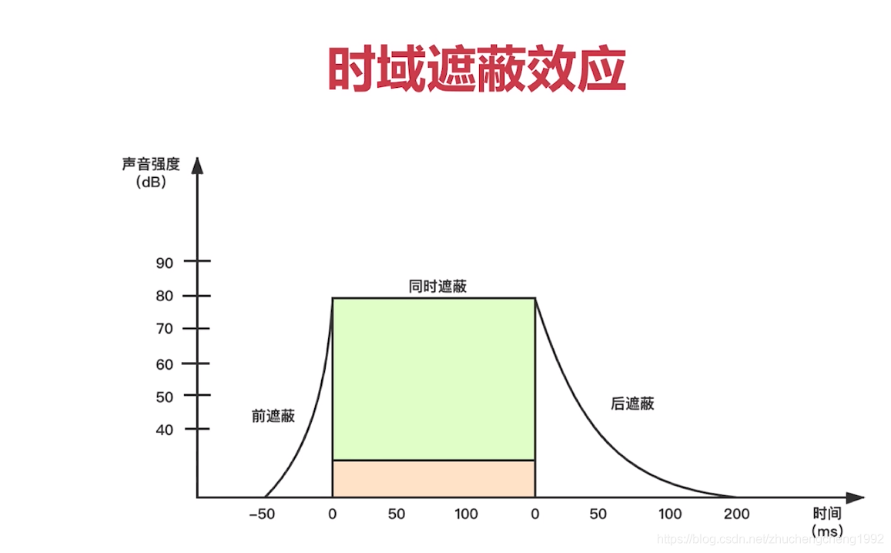
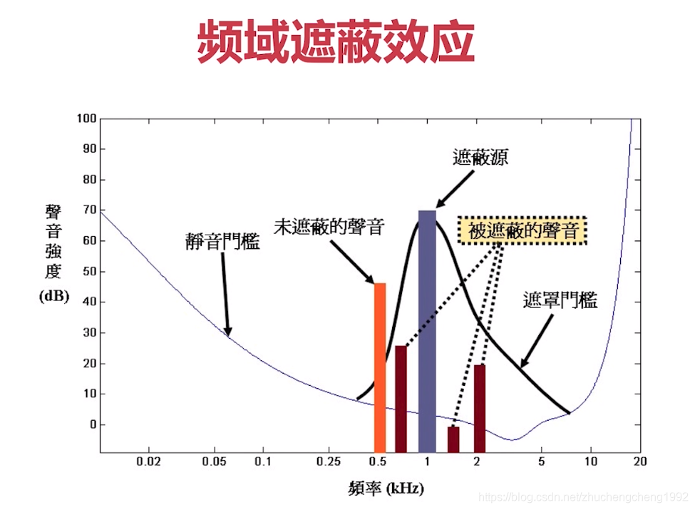
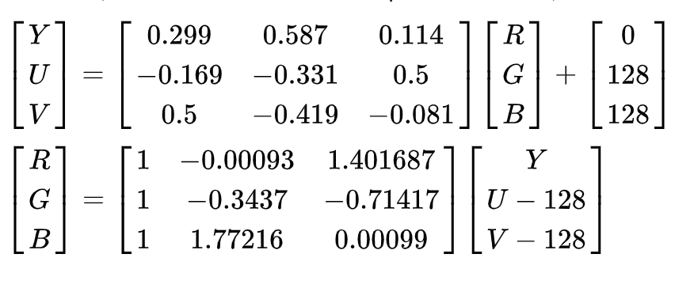
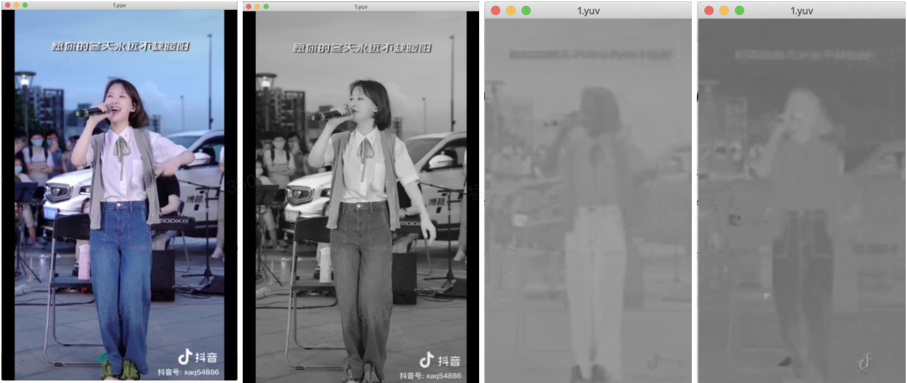
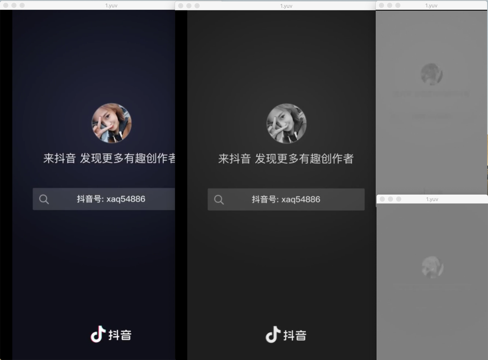
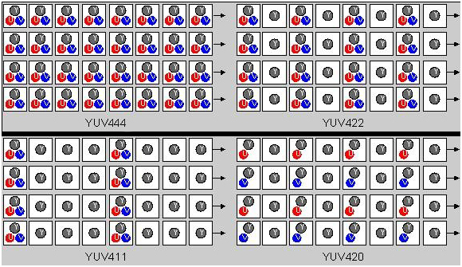

> 2020年基本没怎么写文章，主要是换了一个新的环境，用了大半年更新了一下技术栈，后面开始逐渐把自己的输入收获输出分享出来。😄

### 音频

声音是通过物体振动，经过介质，从而到达人耳，引起耳膜振动。这些大自然的声音都是模拟信号，计算机通过麦克风之类的采样，转化为数字信号。

#### 音频的要素

音频包括采样频率，采样大小，以及声道数三要素，采样频率就是每秒采样的次数，一般最低是8kHz，还可以是44.1kHz，48kHz，甚至更高，采样率越高，采样点之间的间隔越小，采样后的声音和模拟信号的声音越接近。对于采样大小来说，就是每次采样的位数，通常是16位，也就是16bit。采样大小影响的就是声音的精确程度 。声道数包括单声道，双声道，以及多声道，多声道能让人处于声临其境的听觉享受，像影院，就会有多个音响播放声音。

#### 音频压缩

对于采集到的原始的数据来说，44.1kHz的采样频率，16bit的采样，2个声道，需要的带宽就是44100\*16\*2 =  1411.2kbps = 1.4Mbps，这是非常大的数据。因此也就需要编码压缩，压缩分为有损压缩和无损压缩。

有损压缩依赖的是遮蔽效应，如下图所示，无论在时域下，还是通过傅立叶变换将时域转成频域下，声音强度大的声音都会掩盖它附近强度小的声音。在心理声学中, 人耳能听到的声音的频率大约是20Hz-20KHz，因此我们也可以将这个区间之外的声音过滤掉。




女生说话的频率比男生说话的频率高，所以根据这块的内容我们知道，男女朋友吵架声音高是没用的，因为你可能没法遮蔽对方的声音，但是如果几个女生在一起说话，那就是声音高的就能把声音低的掩盖住。

无损压缩使用熵编码，如Huffman编码，出现频率越高的用低位数据编码，出现频率高的用高位数据编码，从而不失真的减小数据的大小。

### 视频

视频是由一帧帧的图像组成，基本上分为I帧，B帧和P帧而每一张的图像都是有分辨率，比如1280\*720， 1920\*1080等，视频每秒的图像帧数是视频的帧率。分辨率影响的是视频的清晰程度，帧率影响的就是视频的流畅度。

所以视频的码率=宽\*高\*帧率，我们可以看下最原始的视频数据能达到多大，以1080\*720的分辨率，每个像素3个字节，每秒30帧为例, 码率=1280\*720\*3\*30\*8=552.96Mbps。原始的音视频数据如果按照家庭的带宽来看的话是远远不够的，因此就会有x264, x265编码压缩。

#### YUV

在前端的理解中，像素点的颜色都是RGB或者RGBA来描述的，也就是三个字节或者四个字节，这个是显示器渲染出来的。而视频在采集或者传输过程中的图像并不是通过RGB来描述的，而是YUV。YUV是指每个像素有三个分量，Y分量、U分量或者Cb分量、V分量或者Cr分量。下面是YUV和RGB的转换公式。



那我们看从抖音下载出来一个小视频，抽离出的YUV数据，YUV单个分量的时候和正常播放的时候的区别

<!--  -->


YUV是从之前的黑白电视机演化而来的，Y分量用来表示明亮度，单独的Y分量播放就是黑白的，而UV用来表示色度。

### YUV格式

那我们为什么会在视频中使用YUV呢？那就需要看下YUV的几种格式，主要有YUV4:4:4， YUV4:2:2，YUV4:1:1，YUV4:2:0。下面这张图展示的非常清晰



YUV4:4:4和RGB的表示是一样的，每个像素需要三个字节来表示，以1280\*720为例，所以图像的大小就是1280\*720\*3。

YUV4:2:2就是每行每隔一列才有UV分量，图像的大小就是1280\\*720 + 2\*1280/2\*720 = 1280\*720\*2, 相比YUV4:4:4来说，Y分量不变，UV分量各减小一半，整个大小减少了1/3。

YUV4:1:1就是每行里面每隔三列才有UV分量，图像的大小就是1280\*720 + 2\*1280\*720/4\*720 = 1280\*720\*1.5，相比YUV4:4:4，整个大小减少1/2。

YUV4:2:0是每行只展示一个U分量或者V分量，并每行间隔一列才展示一个U或者V分量。图像的整体大小和YUV4:1:1是一致的，减少了1/2。

这四种YUV格式，YUV4:2:0是最常用的。从这也能看出为什么要使用YUV了，数据的大小变小了。相应的代价就是数据会丢失，因为UV分量减少了。那为什么不减少Y分量那？是因为人眼对亮度的感知比色度的感知更灵敏，所以也就是丢弃一部分的色度，对于人眼来说影响不大，数据大小确能降低50%。

上面的是我们抽象的分析YUV格式，可以看下下面这张图，这是YUV420的一种平面存储格式。


先是存储Y分量，然后再存储UV分量，YUV在渲染到显示器的时候要转成RGB，而RGB需要YUV三个分量才行，虽然我们说YUV4:2:0每行只展示一个U或者V分量，其实在渲染的时候每个像素点还是有三个分量，以上图为例，四个像素点共用U、V分量。如下

```s
    Y1U1V1   Y2U1V1 
    Y7U1V1   Y8U1V1
```

以上便是本篇的内容，剩下的且听下回分解。

