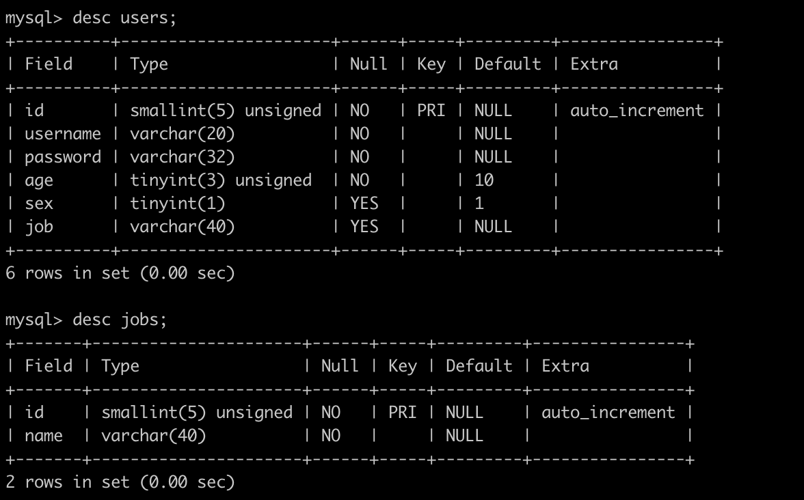
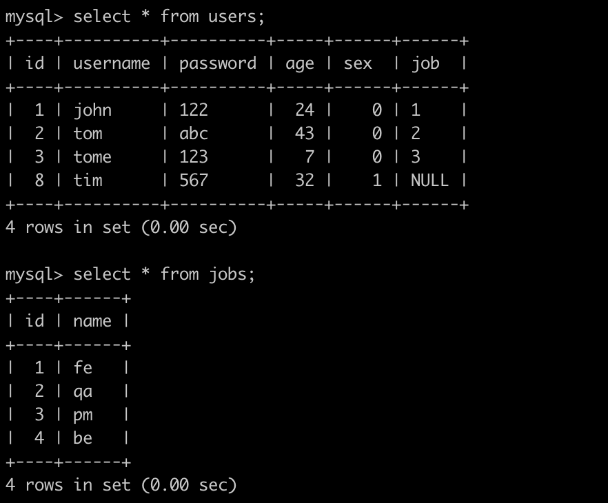
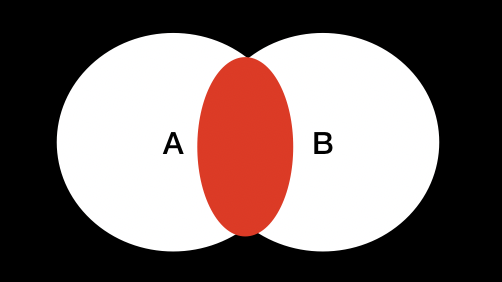
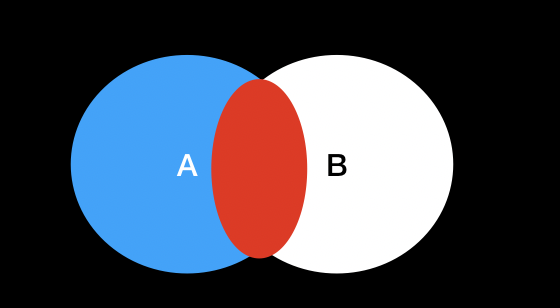
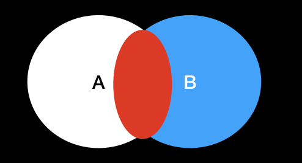
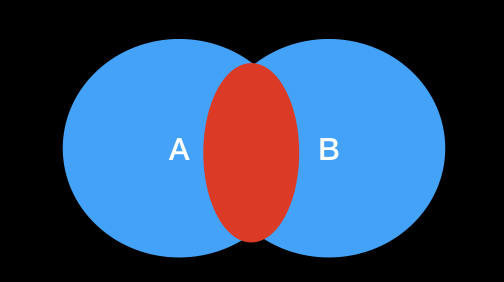

数据库中的join连接就是通过连接谓词将两张表组合在一起，共有五种不同的连接形式，分别为内连接 inner join、左外连接 left outer join、右外连接 right outer join、交叉连接 cross join、 全连接 full join

#### 数据准备

一共有两张表，分别为users和jobs， 表定义如下


users为用户信息，jobs为职业信息

内容为：


#### 内连接

内连接就是得到两个表的交集



如上图所示，将A、B两张表通过内连接连接在一起，返回的是A、B的公共部分，是集合中的交集

```sql
select a.username, a.age, b.name as job_name from users as a
inner join jobs as b
on a.job = b.id;
```

```
+----------+-----+----------+
| username | age | job_name |
+----------+-----+----------+
| john     |  24 | fe       |
| tom      |  43 | qa       |
| tome     |   7 | pm       |
+----------+-----+----------+
```

#### 左外连接

以左表A为基础，包含A，B的公共部分红色部分



```sql
select a.username, a.age, b.name as job_name from users as a 
left join jobs as b 
on a.job = b.id;
```

```
+----------+-----+----------+
| username | age | job_name |
+----------+-----+----------+
| john     |  24 | fe       |
| tom      |  43 | qa       |
| tome     |   7 | pm       |
| tim      | 567 | NULL     |
+----------+-----+----------+
```

当然也可以只取两张表的公共的部分，即红色的部分也就是内连接的结果，这个时候只需要加上过滤条件即可

```sql
select a.username, a.age, b.name as job_name from users as a 
left join jobs as b 
on a.job = b.id
where b.name is not null;
```

```
+----------+-----+----------+
| username | age | job_name |
+----------+-----+----------+
| john     |  24 | fe       |
| tom      |  43 | qa       |
| tome     |   7 | pm       |
+----------+-----+----------+
```

#### 右外连接

右外连接是以右表B为基础，加上A、B两张表公共的部分



```sql
select a.username, a.age, b.name as job_name from users as a  
right  join jobs as b 
on a.job = b.id;
```

```
+----------+------+----------+
| username | age  | job_name |
+----------+------+----------+
| john     |   24 | fe       |
| tom      |   43 | qa       |
| tome     |    7 | pm       |
| NULL     | NULL | be       |
+----------+------+----------+
```

若只想获取右表中自有的数据，同样可以添加过滤条件

```sql
select a.username, a.age, b.name as job_name from users as a  
right  join jobs as b 
on a.job = b.id
where a.username is null;
```

```
+----------+------+----------+
| username | age  | job_name |
+----------+------+----------+
| NULL     | NULL | be       |
+----------+------+----------+
```

#### 全连接



全连接是包含两个表中所有数据的连接操作，但是在Mysql中并不支持，不过我们可以用另一种方式使用全连接

```sql
select a.username, a.age, b.name as job_name from users as a 
left join jobs as b 
on a.job = b.id 
union all 
select a.username, a.age, b.name as job_name from users as a 
right join jobs as b 
on a.job = b.id;
```

```
+----------+------+----------+
| username | age  | job_name |
+----------+------+----------+
| john     |   24 | fe       |
| tom      |   43 | qa       |
| tome     |    7 | pm       |
| tim      |   32 | NULL     |
| john     |   24 | fe       |
| tom      |   43 | qa       |
| tome     |    7 | pm       |
| NULL     | NULL | be       |
+----------+------+----------+
```

#### 交叉连接

交叉连接又叫笛卡尔连接，返回左表中的所有行，并且左表中的每一行与右表中的所有行的一种组合

```sql
select a.username, a.age, b.name as job_name from users as a
cross join jobs as b;
```

```
+----------+-----+----------+
| username | age | job_name |
+----------+-----+----------+
| john     |  24 | fe       |
| tom      |  43 | fe       |
| tome     |   7 | fe       |
| tim      |  32 | fe       |
| john     |  24 | qa       |
| tom      |  43 | qa       |
| tome     |   7 | qa       |
| tim      |  32 | qa       |
| john     |  24 | pm       |
| tom      |  43 | pm       |
| tome     |   7 | pm       |
| tim      |  32 | pm       |
| john     |  24 | be       |
| tom      |  43 | be       |
| tome     |   7 | be       |
| tim      |  32 | be       |
+----------+-----+----------+
```

以上就是join语句的几种用法。