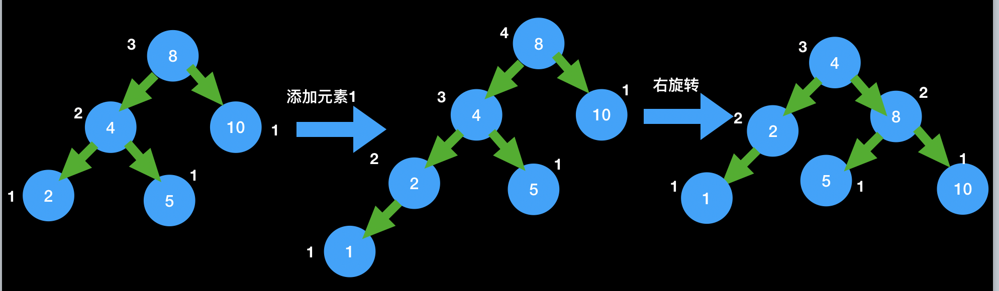
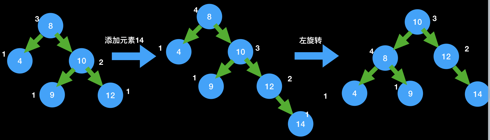
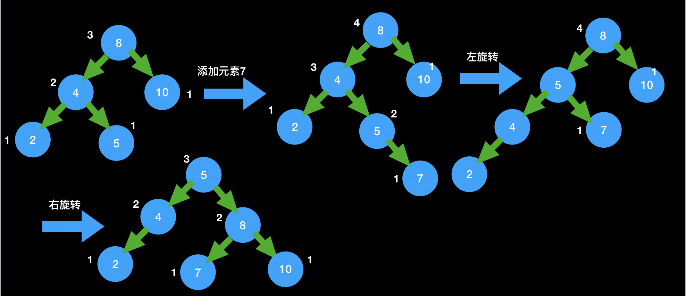
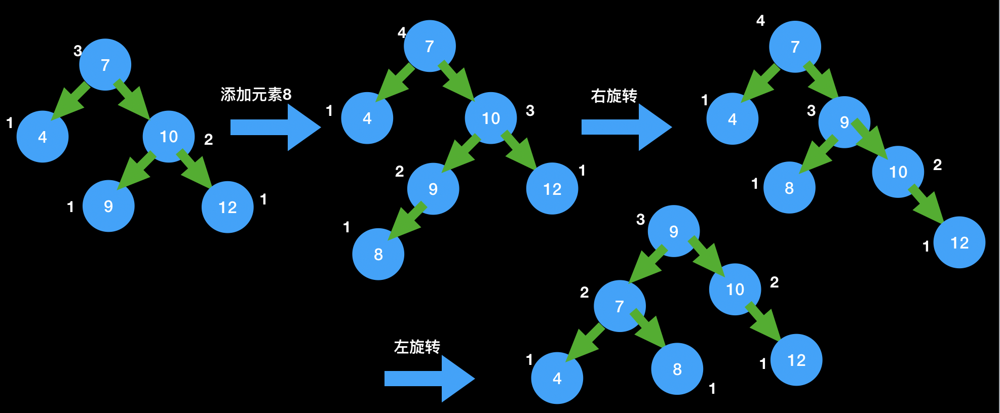

### 背景

之前学习过二叉搜索树BST，顺序的插入数据的时候BST被退化为链表，因此为了防止这种情况的发生，就需要引入一些机制，那就是平衡树。平衡的机制就产生了平衡因子这个概念，它用于表示一个节点的平衡性，如一个节点的平衡因子为1，则表示该节点的左子树和右子树的高度差为1。在这里将平衡因子定义为左子树 - 右子树的差。通过定义能够明白如果一个平衡因子为整数，则表明左子树比右子树高，也就是该节点下左子树比右子树的的节点数多，因为对于一个平衡的子树来说，它的高度是其节点数的logN，因此也就是说该节点下的子树向左偏移了。

自然而然的我们就知道的平衡树的定义：一棵二叉树，对于任意一个节点，左子树和右子树的高度差不能超过1。

下图即为一棵平衡树，括号内表示该节点的高度值，节点的高度值：叶子节点的高度为1，非叶子节点的高度是其左右子树高度的最大值 + 1

```
                                 (4)15
                                /      \
                            (3)6     (2)18
                             /   \     /
                        (2)2   (1)8  (1)12
                           /
                       (1)1
```

因此先生成一个二叉树，之后在引入平衡机制，所以重新实现一个二叉树

#### 定义Node对象

```js
class Node {
  constructor(key, value) {
    this.key = key;
    this.value = value;
    this.left = null;
    this.right = null;
  }
}
```

#### 定义BST构造函数

```js
class BST {
  constructor() {
    this.root = null;
    this.size = 0;
  }
}
```

#### 添加节点

```js
push(key, value) {
  this.root = this.insert(this.root, key, value);
}

insert(node, key, value) {
  if (!node) {
    this.size++;
    return new Node(key, value);
  }

  if (key > node.key) {
    node.right = this.insert(node.right, key, value);
  } else if (key < node.key) {
    node.left = this.insert(node.left, key, value);
  } else {
    node.value = value;
  }

  return node;
}
```

#### 查找节点

```js
find(key) {
  const node = this.get(this.root, key);
  return node;
}

get(node, key) {
  if (!node) {
    return null;
  }

  if (node.key > key) {
    return this.get(node.left, key);
  } else if (node.key < key) {
    return this.get(node.right, key);
  }

  return node;
}
```

#### 删除一棵子树上的最大节点

```js
deleteMax() {
  let max;
  this.root = this._deleteMax(this.root, (node) => max = node);
  return max;
}

_deleteMax(node, cb = () => {}) {
  if (!node) {
    cb(node);
    return null;
  }

  if (!node.right) {
    this.size--;
    cb(node);
    return node.left;
  }

  node.right = this._deleteMax(node.right, cb);
  // return node;
  return this.keepBalance(node);
}
```

#### 删除任意节点

```js
delete(key) {
  this.root = this._delete(this.root, key);
}
_delete(node, key) {
  if (!node) {
    return null;
  }

  if (node.key > key) {
    node.left = this._delete(node.left, key);
  } else if (node.key < key) {
    node.right = this._delete(node.right, key);
  } else {
    if (!node.left) {
      this.size--;
      node = node.right;
    } else if (!node.right) {
      this.size--;
      node = node.left;
    } else {
      let successor;
      node.left = this.deleteMax(node.left, (node) => {
        successor = node;
      });

      successor.left = node.left;
      successor.right = node.right;

      node = successor;
    }
  }

  return node;
}
```

对于一棵二叉树来说，根据我们的定义，刚开始是平衡的，因为只有一个节点的时候还没有左右子节点，其平衡因子为0。之后是因为增加节点从而从平衡变为了不平衡。知道的这个原因，只有针对发生这种结果的几种条件一一枚举出来，才能具体知道如何去维护一棵树的平衡。

### 不平衡条件

#### 第一种

第一种也就是最容易理解的，一直往左子树添加节点，当添加到第三个节点的时候此时不再平衡

```
     8
    /
   4
  /
 1
```

此时节点8的左子树高度为2，右子树的高度为0，因此节点8的平衡因子为2

#### 第二种

第二种相反，一直往右子树添加节点，也是当添加到第三个节点的时候不再平衡

```
   8
    \
     10
      \
      12
```

此时节点8的左子树高度为2，右子树的高度为2，此时节点8的平衡因子为-2

#### 第三种

第三种情况和第一种情况稍有不同，那就是当添加到第三个节点的时候，在第二个节点的右子树上，看示例

```
     8
    /
   4
    \
     5
```

此时节点8的平衡因子和第一种一样都是2， 不同的是节点4的平衡因子为-1

#### 第四种

第四种情况和第二种也只是稍有不同，当添加第三个节点的时候，在第二个节点的左子树上

```
 8
  \
   10
  /
 9
```
此时节点8的平衡因子和第二种一样都是-2， 不同的是节点10的平衡因子为1

这个时候我们把四种情况放到一块再看看

```
    8      8             8       8
    /       \           /         \
   4         10        4           10
  /           \         \          /
 1            12         5        9
(一)         (二)       (三)      (四)
```
(一)和(三)的情况是节点8的平衡因子为2， (二)和(四)的情况是节点8的平衡因子为-2。这只是其中的一点区别，我们再观察一下他们的子节点。(一)中节点4的平衡因子为1、(二)中节点10的平衡因子为-1、(三)中节点4的平衡因子为-1、(四)中节点10的平衡因子为1.

以上只是我们找到的四种情况，那么还有一点没有关注的就是根节点的子节点，在我们这里就是节点10和节点4，它们的平衡因子有可能为0吗？在我们这里都不可能。原因就先拿(一)举例： 如果节点4的平衡因子为0，说明左右子树高度相等，那么也就是在左节点1插入之前，已经有右节点了，这是不可能的，因为如果有右节点则说明此时8这棵树就已经不再平衡了，而不会等到插入节点1的时候再去维护平衡

总结就是

|序号|根节点的平衡因子|根节点的子节点的平衡因子|
|---|---|---|
|(一)|2|1|
|(二)|-2|-1|
|(三) |2|-1|
|(四)|-2|1|

上面考虑的是根节点只有一个子节点的情况，同样的根节点如果两个子节点都存在，是不是还有另外四种情况没有考虑到？

#### 第五种

```js
      8              8
     /  \           /  \
    4   10    =>   4    10
   /              /
  2              2
                /
               1
```
这种情况下也是一直往左子树添加，不同的是根节点的右节点也存在。此时根节点8的平衡因子为2，左节点4的平衡因子为2

#### 第六种

```js
      8              8
     /  \           /  \
    4   10    =>   4    10
          \               \
           12             12
                            \
                             14
```

这种情况下是一直往右子树添加节点，同样的是根节点8存在左节点。此时根节点8的平衡因子为-2，右节点4的平衡因子为-2

#### 第七种

```js
      8              8
     /  \           /  \
    4   10    =>   4    10
   /                \
  2                  5
                      \
                       7
```

这种情况下是先往左子树添加节点，之后向右子树添加节点。此时根节点8的平衡因子为2，左节点4的平衡因子为-2

#### 第八种

```js
      8              8
     /  \           /  \
    4    11   =>   4    11
         /              /
        10             10
                      /    
                     9
```

这种情况下是先往右子树添加节点，之后向左子树添加节点。此时根节点8的平衡因子为-2，右节点11的平衡因子为2

从(五)到(八)这四种情况总结为：

|序号|根节点的平衡因子|根节点的子节点的平衡因子|
|---|---|---|
|(五)|2|2|
|(六)|-2|-2|
|(七) |2|-2|
|(八)|-2|2|

这会也考虑一下，根节点的子节点的平衡因子绝对值有没有可能小于2，(五)是可以的，节点4的平衡因子也可以为1，此时节点4也有两个子节点，这是不影响根节点8的平衡因子。同样(六)的根节点的子节点也可以为-1，(七)的根节点的子节点可以为-1，(八)的根节点的子节点可以为1

现在把八种情况放到一块观察一下

|序号|根节点的平衡因子|根节点的子节点的平衡因子|
|---|---|---|
|(一)|2|1|
|(二)|-2|-1|
|(三) |2|-1|
|(四)|-2|1|
|(五)|2|2或1|
|(六)|-2|-2或-1|
|(七) |2|-2或-1|
|(八)|-2|2或1|

一起观察的时候可以发现(一)是(五)的一种特殊情况，(二)是(六)的一种特殊情况 (三)是(七)的一种特殊情况，(四)是(八)的一种特殊情况

因此我们可以将二叉树的不平衡条件分为四种

1. 根节点平衡因子为2，  根节点的子节点的平衡因子 > 0
2. 根节点平衡因子为-2，  根节点的子节点的平衡因子 < 0
3. 根节点平衡因子为2，  根节点的子节点的平衡因子为< 0
4. 根节点平衡因子为-2，  根节点的子节点的平衡因子为 > 0

### 维持平衡的操作

平衡性是由平衡因子决定的，而平衡因子又是通过节点的高度计算出来的，因此需要修改一下Node构造函数，初始默认height为1

```js
class Node {
  constructor(key, value) {
    this.key = key;
    this.value = value;
    this.left = null;
    this.right = null;
    this.height = 1;
  }
}
```

还需要两个个方法，那就是计算一个节点的高度和平衡因子

```js
getHeight(node) {
  if (!node) return 0;

  return node.height
}

getBalanceFactory(node) {
  if (!node) return 0;

  return this.getHeight(node.left) - this.getHeight(node.right);
}
```

根据以上我们得到的四种不平衡的条件，于是就有四种不同的维护平衡的方法

#### 右旋转RR



此时 根节点平衡因子为2，  根节点的子节点的平衡因子 > 0

```js
rightRotate(node) {
  const child = node.left;
  const child_right = child.right;

  child.right = node;
  node.left = child_right;

  return child;
}

// RR 右旋
if (balanceFactory > 1 && this.getBalanceFactory(node.left) > 0) {
  return this.rightRotate(node);
}
```

#### 左旋转LL



此时根节点平衡因子为-2，  根节点的子节点的平衡因子 < 0

```js
leftRotate(node) {
  const child = node.right;
  const child_left = child.left;

  child.left = node;
  node.right = child_left;

  return child;
}

// LR 左旋
if (balanceFactory < -1 && this.getBalanceFactory(node.right) < 0) {
  return this.leftRotate(node);
} 
```

#### LRR



此时根节点平衡因子为2，  根节点的子节点的平衡因子为< 0

```js
// LRR 左右旋
if (balanceFactory > 1 && this.getBalanceFactory(node.left) < 0) {
  node.left = this.leftRotate(node.left);
  return this.rightRotate(node);
}
```

#### RLR



```js
// RLR 右左旋
if (balanceFactory < -1 && this.getBalanceFactory(node.right) > 0) {
  node.right = this.rightRotate(node.right);
  return this.leftRotate(node);
}
```

因此以上便是四种维护平衡的方法，我们把它封装为一个方法

```js
keepBalance(node) {
  if (!node) return node;

  // 当前节点的平衡因子
  const balanceFactory = this.getBalanceFactory(node);
  
  // 左节点的平衡因子
  const leftChildBalanceFactory = this.getBalanceFactory(node.left);
  
  // 右节点的平衡因子
  const rightChildBalanceFactory = this.getBalanceFactory(node.right);

  if (Math.abs(balanceFactory) > 1) {
    console.log(`balanceFactory: ${balanceFactory}`);
  }


  // RR 右旋
  if (balanceFactory > 1 && leftChildBalanceFactory > 0) {
    return this.rightRotate(node);
  }

  // LR 左旋
  if (balanceFactory < -1 && rightChildBalanceFactory < 0) {
    return this.leftRotate(node);
  } 

  // LRR 左右旋
  if (balanceFactory > 1 && leftChildBalanceFactory < 0) {
    node.left = this.leftRotate(node.left);
    return this.rightRotate(node);
  }

  // RLR 右左旋
  if (balanceFactory < -1 && rightChildBalanceFactory > 0) {
    node.right = this.rightRotate(node.right);
    return this.leftRotate(node);
  }

  return node;
}
```

因此添加节点操作就需要改为：

```js
insert(node, key, value) {
  if (!node) {
    this.size++;
    return new Node(key, value);
  }

  if (key > node.key) {
    node.right = this.insert(node.right, key, value);
  } else if (key < node.key) {
    node.left = this.insert(node.left, key, value);
  } else {
    node.value = value;
  }

  node.height = Math.max(this.getHeight(node.left), this.getHeight(node.right)) + 1;

  return this.keepBalance(node)
}
```

同样删除操作也需要修改

```js
_delete(node, key) {
  if (!node) {
    return null;
  }

  if (node.key > key) {
    node.left = this._delete(node.left, key);
  } else if (node.key < key) {
    node.right = this._delete(node.right, key);
  } else {
    if (!node.left) {
      this.size--;
      node = node.right;
    } else if (!node.right) {
      this.size--;
      node = node.left;
    } else {
      let successor;
      node.left = this._deleteMax(node.left, (node) => {
        successor = node;
      });

      successor.left = node.left;
      successor.right = node.right;

      node = successor;
    }
  }

  return this.keepBalance(node);
}

// 删除子树的最大值
_deleteMax(node, cb = () => {}) {
  if (!node) {
    cb(node);
    return null;
  }

  if (!node.right) {
    this.size--;
    cb(node);
    return node.left;
  }

  node.right = this._deleteMax(node.right, cb);
  return this.keepBalance(node);
}
```

以上便是整个AVL树的内容，通过以上也能看到AVL树就是一棵二叉树，它的查找，添加，删除，最坏情况下也是O(logN), 因此更加的平衡稳定
