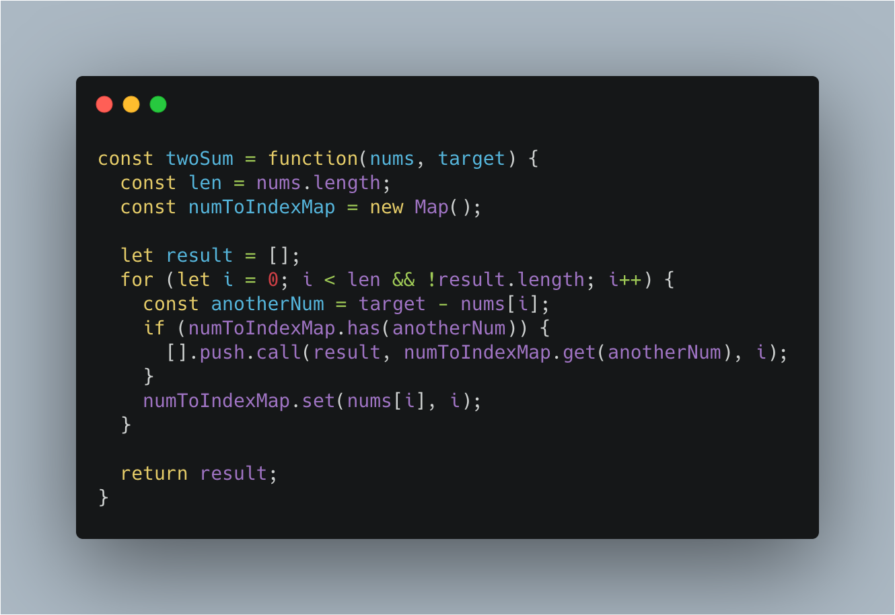
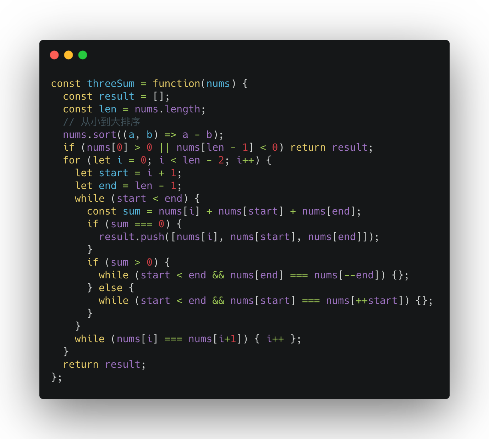
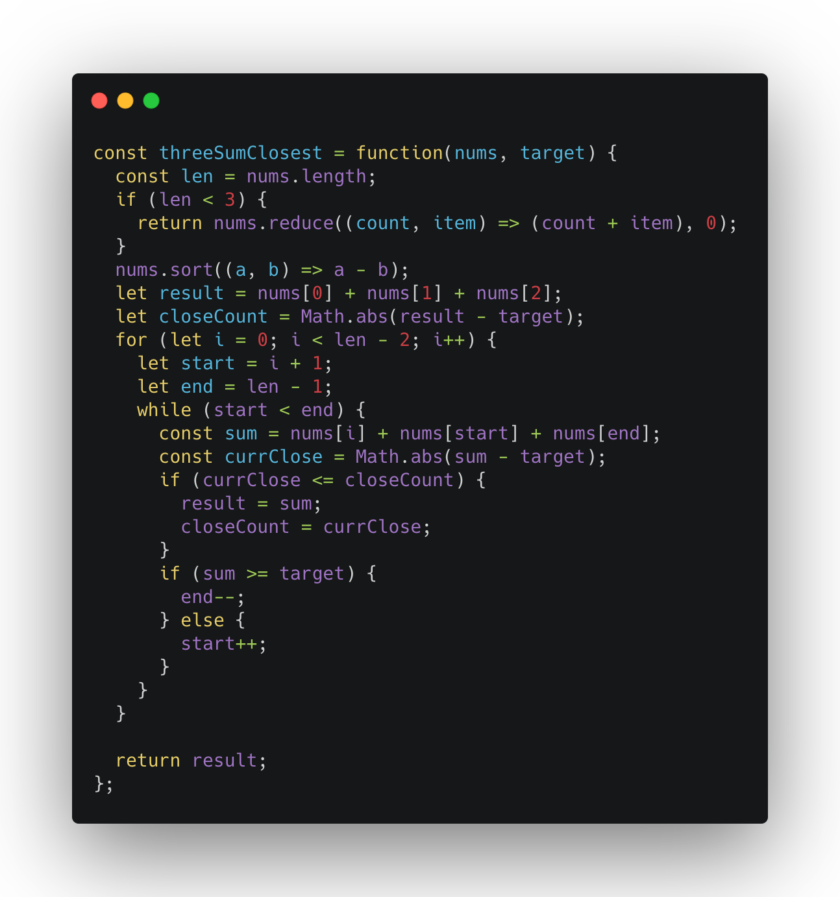
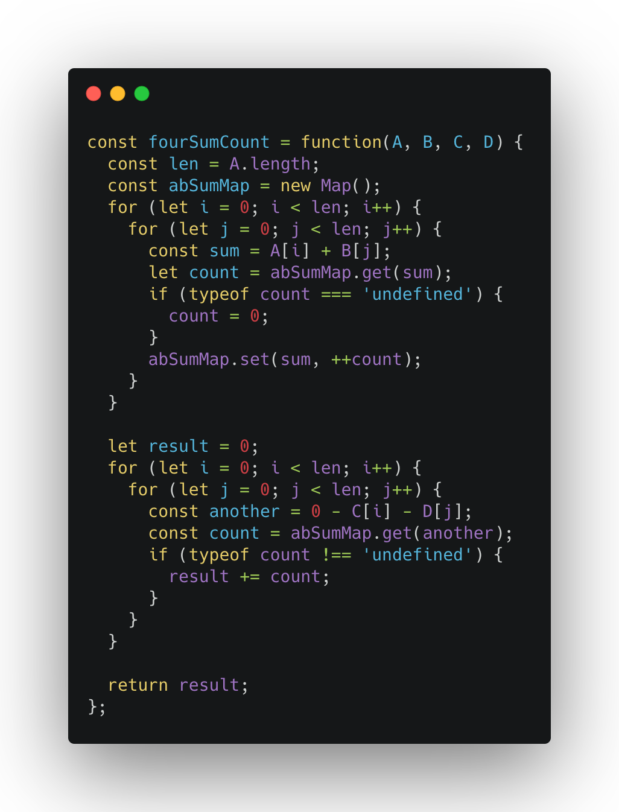

在leetcode上有这么连续几个挺有意思的题目，在一串数字中，找出和为目标值的两个数、三个数、四个数。当然整个的思想都是利用了查找表Set或者Map。那么接下来看一下这几道题。

> leetcode No.1 给定一个整数数组 nums 和一个目标值 target，请你在该数组中找出和为目标值的那 两个 整数，并返回他们的数组下标。你可以假设每种输入只会对应一个答案。但是，你不能重复利用这个数组中同样的元素。
> 给定 nums = [2, 7, 11, 15], target = 9。因为 nums[0] + nums[1] = 2 + 7 = 9，所以返回 [0, 1]

解析：这是一个整数数字，但是并未说明它是有序的，因此使用双指针必须先要排序，排序的时间复杂度通常情况下是O(nlogn), 之后双指针遍历是O(n)的时间复杂度，因此整体的时间复杂度是O(nlogn)。假定排序用快排的话，空间复杂度是O(1)。这是一个思路，那么有没有更好的解法呢？

一般对于一个算法来说，多一点空间上的开销还是能够接受的，压缩时间是我们更愿意接受的一件事，那这道题有没有O(n)的时间复杂度呢？那就是使用查找表。查找表的底层实现一般是平衡树，或者红黑树，或者哈希表。在我们这个题目里面并不需要整型数字之间的顺序，因此哈希就能接受。哈希的空间复杂度是O(n),时间复杂度是O(1)。因此我们尝试用这个思路解决一下。



这里面通过查找和当前值的和等于目标值的另一个元素，这样我们就在O(n)的时间复杂度和O(n)的空间复杂度中解决了这个问题

> leetcode No.15 给定一个包含 n 个整数的数组 nums，判断 nums 中是否存在三个元素 a，b，c ，使得 a + b + c = 0？找出所有满足条件且不重复的三元组。
> 答案中不可以包含重复的三元组。
> 例如, 给定数组 nums = [-1, 0, 1, 2, -1, -4]，满足要求的三元组集合为：
```
 [
 ⁠ [-1, 0, 1],
 ⁠ [-1, -1, 2]
 ]
```

解析：这道题就比刚才那道题要复杂一些，增加了一个纬度。如果用暴力的解法，时间复杂度那就是O(n^3)。这是一个完全不能接受的，不过通过这里，我们也能想到，是否能将其转换为O(n^2)的算法呢？要想降低时间复杂度，那我们就需要增加其他的操作，那在这道题里面能够增加什么操作呢？那就是顺序性，通过排序，之后就可以使用双指针对撞，时间复杂度也就能够降低到O(n^2)。



> leetcode No.18 给定一个包含 n 个整数的数组 nums 和一个目标值 target，判断 nums 中是否存在四个元素 a，b，c 和 d ，使得 a + b + c+ d 的值与 target 相等？找出所有满足条件且不重复的四元组。
> 给定数组 nums = [1, 0, -1, 0, -2, 2]，和 target = 0。满足要求的四元组集合为：
```
 [
 ⁠ [-1,  0, 0, 1],
 ⁠ [-2, -1, 1, 2],
 ⁠ [-2,  0, 0, 2]
 ]
```

解析：这道题和上面那道题的思路是一直的，因为增加为4个数之和了，因此需要再套一层循环就可以了


> leetcode No.16给定一个包括 n 个整数的数组 nums 和 一个目标值 target。找出 nums 中的三个整数，使得它们的和与 target最接近。返回这三个数的和。假定每组输入只存在唯一答案。
> 例如，给定数组 nums = [-1，2，1，-4], 和 target = 1.与 target 最接近的三个数的和为 2. (-1 + 2 + 1 = 2).

解析：这道题其实和第15道题是一致的，只不过我们需要多增加一个变量，用来存储当前的和和目标数的差值。



接下来是最后一道题

> leetcode No.454 给定四个包含整数的数组列表 A , B , C , D ,计算有多少个元组 (i, j, k, l) ，使得 A[i] + B[j] + C[k] + D[l] = 0。为了使问题简单化，所有的 A, B, C, D 具有相同的长度 N，且 0 ≤ N ≤ 500 。所有整数的范围在 -2^28 到 2^28 - 1之间，最终结果不会超过 2^31 - 1 。

解析：这道题给定了四个元祖，而又限制了元祖的大小，那就说明这是给我们的提示。首先 N<500,那就说明这道题可以接受O(n^2)的算法。整数的范围是4个字节，这个在JS中没有问题。因此我们就可以分别将其两两分组，计算其和，最终再整体查找，是否有满足的题解。




