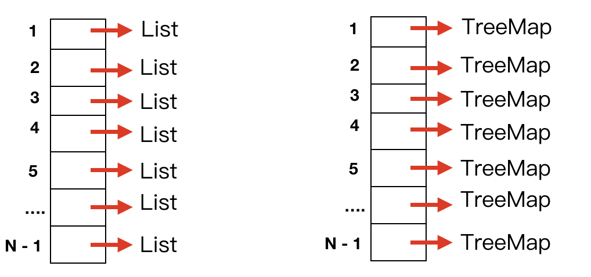

由于上周缺少了一周，本篇是上周的一个补充。

### 概述

hash表就是将我们关心的键通过哈希函数转化为索引，然后就可以直接将内容存储到数组中，因此主要关注的两个点在于哈希函数，和哈希碰撞的处理。对于哈希函数来说，希望得到的索引分布的越均匀越好。

### 哈希函数

基本上键的类型可以分为整型，浮点型，字符串和复合类型，而这些其实都可以转成整型处理。

1. 对于整型来说，小范围的正整数可以直接使用，负整数就可以通过偏移量转成正整数使用，大整数就需要对其取模处理，当然这个模尽可能是一个素数。

2. 对于浮点型的话，计算机内部就是通过32位单精度和64位双精度来处理的，就是使用32位或者64位的二进制来表示

3. 对于字符串，也可以转成整型来处理，简单的26个因为字母，如果不区分大小写，只需要将字母转成整数就可以了。例如

```
code = c * 10^3 + o * 10^2 + d * 10^1 + e * 10^0
c = 2 
o = 15
d = 3
e = 4
```

最终可以将这个值模一个素数就可以了。

当然，所有的问题都转成整型并不是唯一的解决方法，不过普通的问题使用这用方法基本上是没问题的。哈希函数的基本原则就是
1. 一致性，如果两个键相同，则hash索引相同
2. 高效性，计算简单
3. 均匀性，哈希索引分布均匀


### 哈希冲突的处理

对于哈希冲突的处理，有多种处理，一类有线性探测法，平方探测法，另外一类是链地址法，这次主要学习链地址法。

对于线性探测法来说，如果发生了哈希冲突，就会查找当前节点的下一个空闲节点，对于这种方法就会遇到一片节点都被占用的情况，效率就会比较低。因此平方探测法就是每次查找空闲节点都会以1， 4， 9....的间隔来查找。


#### 链地址法 separate chaining

对于链地址法来说，我们使用一个数组，其索引是哈希值。当遇到哈希冲突的时候，当前索引的数组值指向一个链表或者集合。如下图所示



我们可以先看下代码实现

```js
class HashTable {
  static upperAvgTotal = 10;
  static lowerAvgTotal = 2;
  static initCapacity = 7;

  constructor() {
    this.hashTable = [];
    this.hashLength = HashTable.initCapacity;
    for (let i = 0; i < this.hashLength; i++) {
      this.hashTable[i] = new Map();
    }
  }
}
```

这里使用的类的静态属性，对于NodeJs来说，这种用法需要的node版本至少要是12，因此这点需要注意，并且在ES6中map的底层实现其实也是一个哈希表，这里我们主要学习哈希表的原理，复杂度问题暂时不用考虑。并且考虑到哈希的动态扩容，因此增加了upperAvgTotal和lowerAvgTotal，表示哈希冲突的平均值的上限和下限。

接下来看下哈希函数如何实现

```js
hash(key) {
  return key.toString().split('').reduce((total, item) => {
    total += item.charCodeAt(0);
    return total;
  }, 0) % this.hashLength;
}
```

这里我是先将键转成字符串，然后将字符串转成数值，最终模一个hashLength。

```js
add(key, value) {
  const map = this.hashTable[this.hash(key)];
  if (map.has(key)) {
    map.set(key, value);
  } else {
    map.set(key, value);
    this.size++;

    if (this.size > HashTable.upperAvgTotal * this.hashLength) {
      this.resize(2 * this.hashLength)
    }
  }
}
```

添加操作就是将key，value添加到对应的map中去。当然如果当前添加的元素数量大于上限的时候，需要增加哈希表的长度

```js
remove(key) {
  const map = this.hashTable[this.hash(key)];
  let ret = null;
  if (map.has(key)) {
    ret = map.get(key);
    map.delete(key);
    this.size--;

    if (
      this.size < HashTable.lowerAvgTotal * this.hashLength 
      && 
      this.hashLength / 2 > HashTable.initCapacity
    ) {
      this.resize(this.hashLength / 2);
    }
  }

  return ret;
}
```

删除一个key也是一样的，将其从hashTable中相应的map中删除，如果当前的元素数量小于下限的时候，就需要减少哈希表的长度

```js
get(key) {
  const map = this.hashTable[this.hash(key)];

  if (!map.has(key)) {
    throw new Error(`${key} 不存在`);
  }

  return map.get(key);
}

contains(key) {
  const map = this.hashTable[this.hash(key)];
  return map.has(key);
}
```

查找操作更简单了，只需要看下是否包含该key就可以啦。接下来主要看下resize操作

```js
resize(newLength) {
  const newHashTable = [];
  for (let i = 0; i < newLength; i++) {
    newHashTable[i] = new Map();
  }

  const oldHashLength = this.hashLength;
  this.hashLength = newLength;

  for (let i = 0; i < oldHashLength; i++) {
    const map = this.hashTable[i];

    for (let [key, value] of map.entries()) {
      newHashTable[this.hash(key)].set(key, value);
    }
  }

  this.hashTable = newHashTable;
}
```

先生成一个新的hashTable，之后将旧的hashTable的内容依次复制过来。

以上便是哈希表的内容，其实理解了其原理，实现起来还是相对比较简单的。

