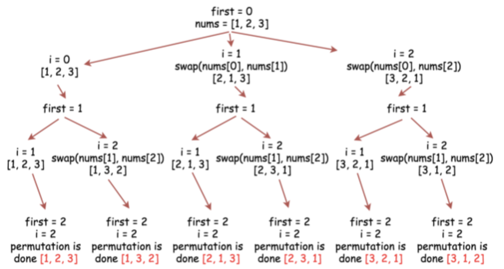

最近一段时间在学习排列组合算法，现在的进度也只能算属于刚入门的状态，不过两周没写总结了，这篇文章应当属于入门级别的，慢慢来不急。

排列组合这是我们在高中数学中都学过的内容，如从1到N，N个数全排列，或者从中取出m个数组合在一起，总共有多少个结果。如果把每个结果都写出来的话，按照顺序一个一个的就写出来了，也可能写了一大页。全排列的所有个数为N的阶层，而组合的所有个数为N!/((N - m)! * m!)。

那么接下来看下如何通过程序完成排列组合

#### 全排列

> leetcode 46题，给定一个没有重复数字的序列，返回其所有可能的全排列。
> 示例 输入: [1,2,3]
```
  输出:
  [
  ⁠ [1,2,3],
  ⁠ [1,3,2],
   [2,1,3],
   [2,3,1],
   [3,1,2],
   [3,2,1]
  ]
```

以示例来说，长度为3的数组，那么每一个排列的长度也是3，对于排列的结果的来说，第一位上的值可以是输入数组的每个索引对应的值，当选中排列结果的第一位的时候，第二位就是第一位选中后剩下的值，依次类推，当到达第三位的时候，就可以将这个排列结果放到结果中了

```js
const swap = (list, i, j) => {
  const tmp = list[i];
  list[i] = list[j];
  list[j] = tmp;
};
const permute1 = function(nums) {
  const ret = [];
  const len = nums.length;
  const backTrack = (index, currResult) => {
    if (index >= len - 1) {
      ret.push([...currResult]);
      return;
    }
    
    for (let i = index; i < len; i++) {
      swap(nums, index, i);
      backTrack(index + 1, currResult);
      swap(nums, i, index);
    }
  };
  backTrack(0, []);
  return ret;
};
```

以示例为例，backTrack(0, [])的时候，依次将1， 2， 3放到排列结果的第0个索引处，随即backTrack(1, [1])、backTrack(1, [2])，backTrack(1, [3])等等

展开来看就是这么一张图


#### 组合
> leetcode 77题，给定两个整数 n 和 k，返回 1 ... n 中所有可能的 k 个数的组合。
> 示例 输入: n = 4, k = 2
```
[
  [2,4],
  [3,4],
  [2,3],
  [1,2],
  [1,3],
  [1,4],
]
```
首先，我们只能选中k位，同时组合和排列不同，没有顺序性，因此位置不同的几个相同的数列是不符合我们的要求的，如 [1, 2]和[2, 1]在组合中是一样的，这一点需要注意。同时我们在递归的过程中不仅需要知道当前选中元素是第几位，同时应该知道我还能选中几位，具体看代码

```js
const combine = (n, k) => {
  const ret = [];
  const backTrack = (start, index, currResult) => {
    if (index <= 0) {
      ret.push([...currResult]);
      return;
    }
    for (let i = start; i <= n; i++) {
      currResult.push(i);
      backTrack(i + 1, index - 1, currResult);
      currResult.pop();
    }
    
  };
  backTrack(1, k, []);
  return ret;
};
```

当剩余还能选中的元素个数为0的时候剪枝，并将此时的数列放入到结果中。在递归回溯的时候需要记得将递归前入栈的元素推出，这样才能让下一个数列的状态是干净的。


