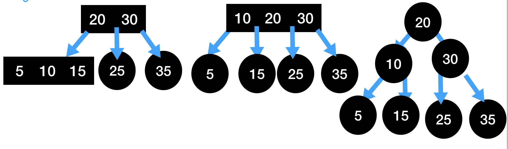

红黑树和AVL树一样，都是二叉搜索树衍化过来的，通过增加了平衡机制，使得BST在最坏的情况下都不会退化为链表。学习红黑树就需要先了解2-3树，2-3树就是说节点要么是2节点，要么是3节点。这种2节点、3节点的定义就是孩子节点的数目可以有多少，可以有两个子节点的节点为2节点，可以有三个子节点的节点为3节点

|  |   |
|:-|:-|
|2节点|3节点|

2-3树是一个绝对平衡的树，因此可以看下在插入节点时，2-3树是如何维护平衡的？


上图是连续添加了两个节点的情况下，这时候发现添加节点5之后，树的最左侧节点已经不符合2-3树的定义了，成为了一个4节点，这个时候2-3是如何维护其自身定义的呢？




因此可以看出2-2树维护自身定义的方式。

以上便是2-3树的大致的介绍，能够看出2-3树是一棵绝对平衡的树，像之前定义的AVL树，也只是左右节点的高度差不超过1，而2-3树子节点的高度永远是一致的。

接下来就需要看看红黑树了，理解了2-3树再看红黑树就相对要简单一些了。

### 红黑树

#### 红黑树定义

红黑树的五点性质：
  1. 每个节点或者是红色的，或者是黑色的
  2. 根节点是黑色的
  3. 每个叶子节点（也就是最后的空节点）是黑色的
  4. 如果一个节点是红色的，那么他的孩子节点都是黑色的
  5. 从任意一个节点到叶子节点，经过的黑色节点是一样的，是一个保持黑平衡的二叉树

#### 红黑树添加节点(一)

同样的需要一步一步的来模拟红黑树是如何添加节点的


初始只有一个节点，根据BST的插入规则，将节点5放到根节点10的左侧，我们定义为新插入的节点都是红色的，红色节点可以看作是2-3树中的3节点的左边节点


这个时候，我们继续添加节点3，如果是BST的话就退化为了链表，因此我们先右旋转一次，然后将之前根节点10和当前的根节点5的颜色互换。然后在反转颜色，最后还需要将根节点的颜色设置为黑色。


#### 红黑树添加节点(二)


这次的添加节点和上一种的有些不一致，这次需要添加节点6的时候在节点5的右侧，因此需要针对其做一次左旋转，然后就演变为第一种的情况。之后的操作和第二种就一样了。

#### 红黑树添加节点(三)


这种情况下就更简单了，它就是前两种操作的一个子集。

#### 实现

接下来就需要代码实现，我们可以直接在BST的代码上修改

```js
const BLACK = true;
const RED = false;

class Node {
  constructor(key, value) {
    this.key = key;
    this.value = value;

    this.color = RED;
    this.left = null;
    this.right = null;
  }
}
```
Node节点多了一个color属性，表明其是黑节点还是红节点，初始为红节点

```js
class RBT {
  constructor() {
    this.size = 0;
    this.root = null;
  }

  isRed(node) {
    if (!node) {
      return BLACK;
    }
    return node.color;
  }
}
```

以上便是RBT的构造函数，我们增加一个方法isRed作为判断节点是否为红节点

```js
// 右旋转
rightRotate(node) {
  const leftNode = node.left;

  node.left = leftNode.right;
  leftNode.right = node;

  leftNode.color = node.color;
  node.color = RED;

  return leftNode;
}
```

```js
// 左旋转
leftRotate(node) {
  const rightNode = node.right;

  // 左旋转
  node.right = rightNode.left;
  rightNode.left = node;

  rightNode.color = node.color;
  node.color = RED;

  return rightNode;
}
```

左右旋转和AVL的是一致的

```js
// 颜色反转
flipColor(node) {
  node.color = RED;
  node.left.color = BLACK;
  node.right.color = BLACK;
}
```
根据我们之前的推演，同样需要有一个步骤是颜色反转。接下来我们就看看如何将这几个步骤插入到添加节点的操作中

```js
append(key, value) {
  this.root = this._add(this.root, key, value);
  this.root.color = BLACK; // 保持最终的根节点为黑色
}

_add(node, key, value) {
  if (!node) {
    return new Node(key, value);
  }

  if (key > node.key) {
    node.right = this._add(node.right, key, value);
  } else if (key < node.key) {
    node.left = this._add(node.left, key, value);
  } else {
    node.value = value;
  }

  // 左旋转
  if (this.isRed(node.right) && !this.isRed(node.left)) {
    node = this.leftRotate(node);
  }

  // 右旋转
  if (this.isRed(node.left) && this.isRed(node.left.left)) {
    node = this.rightRotate(node);
  }

  // 颜色反转
  if (this.isRed(node.left) && this.isRed(node.right)) {
    node = this.flipColor(node);
  }

  return node;
}
```

以上的实现和之前的一步步推导的思路是一样的，因此可以发现，对于AVL树和红黑树而言，都是针对BST的不稳定情况下增加了平衡机制。并且能够发现红黑树的高度是AVL树的2倍，因此对于搜索来说，红黑树要比AVL树慢一些。那么对于已经有AVL树了，为何还需要红黑树呢？这是因为虽然红黑树的搜索会慢一些，但是更新操作要比AVL树要快，因此如果不是主要查询的情况下，红黑树要比AVL树性能要好。
