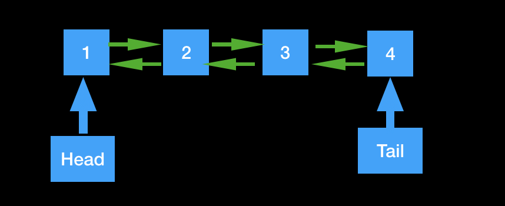
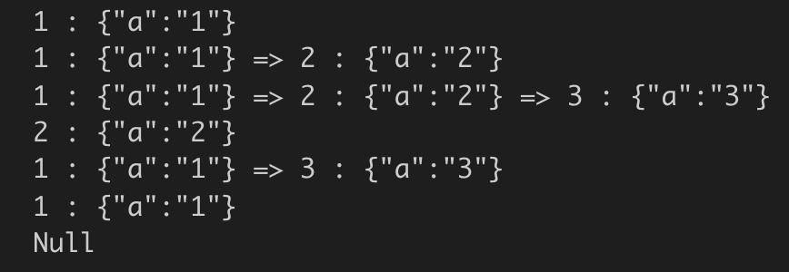

### 背景概论

在计算机结构中我们知道CPU和内存的速度是严重不匹配的, 如果每一次取数据都是直接向内存中取，那么会造成CPU的大量空转，因此会有一块Cache，叫做高速缓存，而之所以会增加高速缓存，是因为在计算机领域中有一个原理：访问局部性，也叫做局部性原理。

>访问局部性（英语：Locality of reference）指的是应用程序在访问内存的时候，倾向于访问内存中较为靠近的值。一种是时间局部性，另一种是空间局部性。时间局部性指的是，程序在运行时，最近刚刚被引用过的一个内存位置容易再次被引用，比如在调取一个函数的时候，前不久才调取过的本地参数容易再度被调取使用。空间局部性指的是，最近引用过的内存位置以及其周边的内存位置容易再次被使用。
                                    --- wikipedia维基百科


同样在操作系统内，32位的操作系统最大的内存为4G（2^32）,当一个几十G，几百G的进程启动的时候，加载到内存中的往往是一部分的数据，其他的数据都是放到了辅存里面，也就是磁盘中。这个时候内存也是充当了缓存的功能。

当然这两个的原因是不同的，一个是速度的问题，一个是容量的问题。但是解决方法的原理都是一样的，通过中间增加了缓存，解决了资源不够的问题。

因此这也就衍生了缓存的高效利用的算法，叫做缓存置换算法。具体的实现方式有三种，分别为FIFO(先进先出)、LRU(最近最少使用算法)、LFU(最不经常使用算法)。

三种算法的数据结构也有多种，本次主要使用双向链表的实现来完成三种算法。首先来看下如何实现一个双向链表

### 双向链表实现



双向链表的每个节点有两个指针，分别指向前驱和后继，也有两个指针，分别指向头节点和尾节点，头节点的前驱为空，尾节点的后继也为空。

#### 链表节点的实现

```js
class Node {
  // 构造函数 节点的表示形式为 k-v
  constructor(key, value) {
    this.key = key;
    this.value = value;

    this.next = null;
    this.prev = null;
  }
  
  // 辅助展示的打印方法
  toString() {
    return `${this.key} : ${JSON.stringify(this.value)}`;
  }
}
```
Node节点传入key和value，作为键值，next和prev默认为空


#### 双向链表构造函数

```js
class DoubleLinkedList {
  constructor(capacity = 100) {
    // 头尾节点
    this.head = null;
    this.tail = null;
    
    // 容量
    this.capacity = capacity;
    // 节点数
    this.count = 0;
  }
}
```

#### 双向链表添加元素

* 头部添加

只需要记住一点的是头部元素的prev为null就行

```js
// 头部添加元素
unshift(key, value) {
  const newNode = new Node(key, value);
  if (!this.head) {
    this.head = newNode;
    this.tail = newNode;
    this.head.prev = null;
    this.head.next = null;
  } else {
    newNode.next = this.head;
    this.head.prev = newNode;
    this.head = newNode;
    this.head.prev = null;
  }
  this.count++;
  return newNode;
}
```

* 尾部添加

同样的需要知道尾部的next指针为null

```js
// 尾部添加节点
push(key, value) {
  const newNode = new Node(key, value);
  if (!this.tail) {
    this.tail = newNode;
    this.head = newNode;
    this.tail.next = null;
    this.tail.prev = null;
  } else {
    newNode.prev = this.tail;
    this.tail.next = newNode;
    this.tail = newNode;
    this.tail.next = null;
  }

  this.count++;
  return newNode;
}
```
* 通过key获取key所在节点的value值

```js
// 获得任意key所在的节点
get(key) {
let currNode = this.head;
let returnNode = null;
while (currNode) {
 if (currNode.key === key) {
   returnNode = currNode;
   break;
 }
 currNode = currNode.next;
}

return returnNode;
}
```

* 删除头节点

```js
// 删除头节点
shift() {
  if (!this.head) {
    return null;
  }

  const deleteNode = this.head;
  if (deleteNode.next) {
    deleteNode.next.prev = null;
    this.head = deleteNode.next;
  } else {
    this.head = this.tail = null;
  }

  this.count--;
  return deleteNode;
}
```

* 删除尾节点

```js
// 删除尾节点
pop() {
  // 尾部为空 返回null
  if (!this.tail) {
    return null;
  }

  const deleteNode = this.tail;
  // 有上一个节点
  if (deleteNode.prev) {
    deleteNode.prev.next = null;
    this.tail = deleteNode.prev;
  } else {
    // 没有上一个节点
    this.tail = this.head = null;
  }

  this.count--;
  return deleteNode;
}
```

* 删除key所在的节点

```js
// 删除任意node节点
delete(node) {
   // node不存在 则删除尾节点
   if (!node) {
    return this.deleteTail();
   }
   // 删除的节点为头节点  
   if (node === this.head) return this.shift();
   // 删除的节点为尾节点
   if (node === this.tail) return this.pop();

   node.next.prev = node.prev;
   node.prev.next = node.next;
   this.count--;
   return node;
}
```

为双向链表添加toString方法，方便打印查看链表内容

```js
// 打印
toString() {
  let currNode = this.head;
  let result = '';
  while (currNode) {
    result += currNode.toString();
    currNode = currNode.next;
    if (currNode) {
      result += ' => ';
    }
  }
  console.log(result || 'Null');
  return result;
}
```

使用

```js
const list = new DoubleLinkedList(10);
// 头部添加节点
list.unshift(1, { a: '1' });
// 打印
list.toString();
// 尾部添加节点
list.push(2, { a: '2' });
// 打印
list.toString();
// 尾部添加节点
list.push(3, { a: '3' });
// 打印
list.toString();
// 打印key为2的节点
console.log(list.get(2).toString());
// 删除key为2的节点
list.delete(list.get(2));
// 打印
list.toString();
// 弹出尾部节点
list.pop();
// 打印
list.toString();
// 弹出头部节点
list.shift();
// 打印
list.toString();
```




### 缓存置换算法

接下来就可以根据双向链表实现缓存置换算法。

#### 先进先出算法 FIFO first input first out

将缓存看作一个先进先出的队列，然后当缓存满的时候，将队列头部的节点替换

```js
const DoubleLinkedList = require('./doubleLinkList');

class FIFOCache {
  constructor(capacity = 0) {
    this.capacity = capacity;
    this.count = 0;

    this.map = {};
    this.list = new DoubleLinkedList(capacity);
  }
}
```

capacity作为缓存的容量，当等于该容量时替换旧的数据节点。this.map作为节点的映射，节点的key作为键值，节点作为value。this.list是链表的实例。

```js
get(key) {
  if (!this.map[key]) {
    return null;
  }
  
  return this.map[key].value;
}
```

先判断map中是否包含该节点，包含返回map中的值，否则返回null。

```js
put(key, value) {
  if (!this.capacity) {
    return null;
  }
  
  if (this.map[key]) {
    // 删除旧数据
    const oldNode = this.map[key];
    this.list.delete(oldNode);
    this.count--;
  } else {
    if (this.capacity === this.count) {
       // 容量已满 删除头节点
      const oldNode = this.list.shift();
      delete this.map[oldNode].key;
      this.count--;
    }
  }

  // 将新数据插入链表尾部
  const newNode = this.list.push(key, value);
  this.map[newNode.key] = newNode;
  this.count++;
}
```
put方法首先判断map中是否包含该键，包含则删除旧的节点，否则再判断是否容量已满，容量已满则删除头节点。 最终将新的数据插入到链表的尾部，并更新map中的数据


#### 最近最少使用算法 LRU least recently used
  
当我们把之前插入的数据放到链表当头部，新插入的节点放到链表当尾部，每次获取数据时，我们都将该节点放到链表的尾部，最终删除节点的时候只需要从头部删除就可以了。这样就保证了头部的节点是当前最近最少使用的数据。看代码，和FIFO的类似

```js
class LRUCache {
  constructor(capacity = 0) {
    this.capacity = capacity;
    this.count = 0;

    this.map = {};
    this.list = new DoubleLinkedList(capacity);
  }

  get(key) {
    const node = this.map[key];
    if (!node) {
      return null;
    }
    // 删除链表中的节点
    // 将其放到链表的尾部
    this.list.delete(node);
    this.list.push(key, node.value);
    return node.value;
  }

  put(key, value) {
    if (!this.capacity) return null;

    const currNode = this.map[key];
    if (currNode) {
      // 删除当前节点
      this.list.delete(currNode);
      this.count--;
    } else {
      // 删除老的节点
      if (this.capacity === this.count) {
        const oldNode = this.list.shift();
        delete this.map[oldNode.key];
      }
    }
    // 被使用的节点放到链表的尾部
    const newNode = this.list.push(key, value);
    this.map[key] = newNode;
    this.count++;
  }

  toString() {
    this.list.toString();
  }
}
```
 
#### 最不经常使用算法 LFU least frequently used

LFU需要淘汰的是使用频率最低的节点，这个时候就需要针对每个节点增加表示其频率的字段。同样在映射中也需要增加不同频率的映射。先看代码吧

```js
class LFUCache {
  constructor(capacity = 0) {
    this.capacity = capacity;
    this.count = 0;
    
    this.map = {};
    this.freqMap = {};
  }
} 
```

在这里多了一个freqMap，因为要在freqMap中保存不同频率的链表，其键为频率值，其值为包含该频率节点的链表。这里还需要实现一个更新其频率的方法

```js
updateFreq(node) {
  let freq = node.freq;
  // 删除node之前所在频率的链表
  node = this.freqMap[freq].delete(node);
  // 链表不包含数据了，删除该链表
  if (!this.freqMap[freq].count) {
    delete this.freqMap[freq];
  }
   
  // 频率自增
  freq++;
  // 是否存在新频率的链表，不存在则创建
  if (!this.freqMap[freq]) {
    this.freqMap[freq] = new DoubleLinkedList(this.capacity);
  }
  
  // 节点插入新的频率列表
  const newNode = this.freqMap[freq].push(node.key, node.value);
  newNode.freq = freq;
  // 返回新的节点
  return newNode;
}
```
   
当访问一个节点的时候，动态的更新该节点的频率值，并且更新其所在的链表，接下来看下get操作

```js
get(key) {
  const node = this.map[key];
  if (!node) {
    return null;
  }
  
   this.updateFreq(node);
   return node.value;
}
```

查看本地map中是否存在该节点，然后更新频率值，返回节点的值。麻烦一些的是put操作

```js
put(key, value) {
  if (!this.capacity) return null;
  
  const currNode = this.map[key];
  let newNode;
  // 命中缓存
  if (currNode) {
    currNode.value = value;
    newNode = this.updateFreq(currNode);
    this.map[key] = newNode;
  } else {
    // 缓存已满
    if (this.capacity === this.count) {
      const minFreq = Math.min.apply(null, Object.keys(this.freqMap));
      const oldNode = this.freqMap[minFreq].pop();
      // 链表不包含数据了，删除该链表
      if (!this.freqMap[freq].count) {
        delete this.freqMap[freq];
      }
      delete this.map[oldNode.key];
      this.count--;
    }
    
    const initFreq = 1;
    if (!this.freqMap[initFreq]) {
      this.freqMap[initFreq] = new DoubleLinkedList(this.capacity);
    }
    
    newNode = this.freqMap[initFreq].push(key, value);
    newNode.freq = initFreq;
    this.map[newNode.key] = newNode;
    this.count++;
  }
  
  return newNode;
}

```
需要先判断是否命中缓存，如果this.map中存在，则更新频率，更新this.map中的值， 否则没有命中缓存，查看缓存是否已满，满的话，找到最小频率，删除其尾部的节点

由于为了和FIFO和LRU链表中的Node节点保持一直，所以说在代码中硬编码了freq属性，不过主要的思路都是一致的。